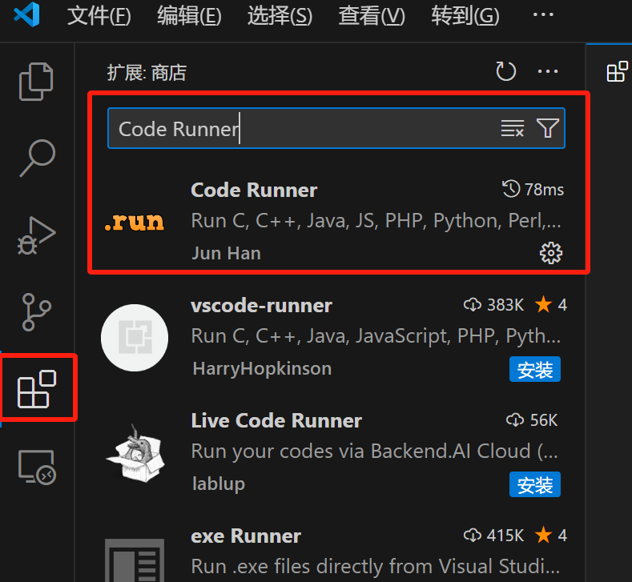
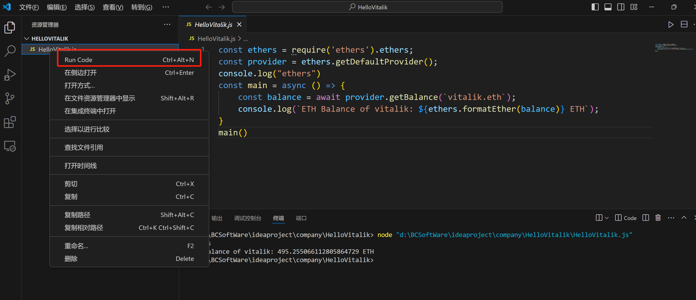
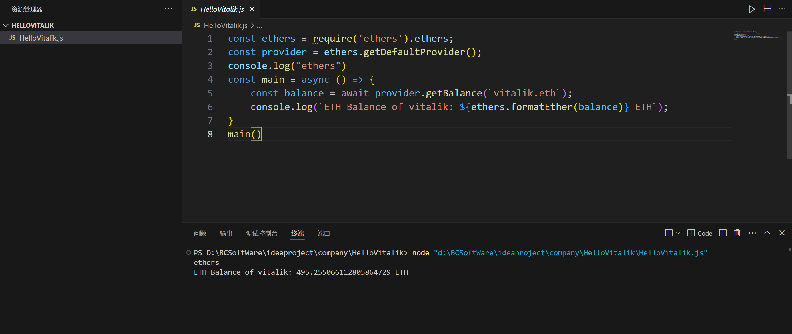
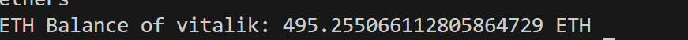

> 本教程使用 ethers.js 最新的 v6 版本,ethers[v6]官方文档：<u>[https://docs.ethers.io/v6/](https://docs.ethers.io/v6/)</u>

`ethers.js` 是一个完整而紧凑的开源库，用于与以太坊区块链及其生态系统进行交互。如果你要写 Dapp 的前端，你就需要用到 `ethers.js`。

与更早出现的 `web3.js` 相比，它有以下优点：

1. 代码更加紧凑：`ethers.js` 大小为 116.5 kB，而 `web3.js` 为 590.6 kB。
2. 更加安全：`Web3.js` 认为用户会在本地部署以太坊节点，私钥和网络连接状态由这个节点管理（实际并不是这样）；`ethers.js` 中，`Provider` 提供器类管理网络连接状态，`Wallet` 钱包类管理密钥，安全且灵活。
3. 原生支持 `ENS`。


## **开发工具**

1. **VScode（推荐）**

你可以使用本地 `vscode` 进行开发。你需要安装<u>Node.js</u>，新建一个 `HelloVitalik` 文件夹,然后利用包管理工具 `npm` 安装 `ethers` 库：

`npm install ethers --save`

## **HelloVitalik**

现在，让我们用 `ethers` 编写第一个程序 `HelloVitalik`：查询 Vitalik 的 `ETH` 余额，并输出在 `console` 中。整个程序只需要 6 行，非常简单！

```javascript
import { ethers } from "ethers";
const provider = ethers.getDefaultProvider();
const main = async () => {
    const balance = await provider.getBalance(`vitalik.eth`);
    console.log(`ETH Balance of vitalik: ${ethers.formatEther(balance)} ETH`);
}
main()
```

开始运行 js 代码

首先需要安装运行代码的插件，选择安装 Code Runner 这个插件



右键点击 js 文件，出现 run code 选项，点击运行代码



出现运行结果



我们逐行分析这个程序：

1. **导入ethers**

第一行的作用是导入已经安装好的 `ethers` 库：

```javascript
import { ethers } from "ethers";
```

2. **连接以太坊**

在 `ethers` 中，`Provider` 类是一个为以太坊网络连接提供抽象的类，它提供对区块链及其状态的只读访问。我们声明一个 `provider` 用于连接以太坊网络。`ethers` 内置了一些公用 `rpc`，方便用户连接以太坊：

```javascript
const provider = ethers.getDefaultProvider();
```

**注意:**`ethers` 内置的 `rpc` 访问速度有限制，仅测试用，生产环境还是要申请个人 `rpc`。比如:

```javascript
const ALCHEMY_MAINNET_URL = 'https://eth-mainnet.g.alchemy.com/v2/oKmOQKbneVkxgHZfibs-iFhIlIAl6HDN';
const provider = new ethers.JsonRpcProvider(ALCHEMY_MAINNET_URL)
```

3. **声明****async****函数**

由于和区块链交互不是实时的我们需要用到 js 的 `async/await` 语法糖。每次和链交互的调用需要用到 `await`，再把这些用 `async` 函数包裹起来，最后再调用这个函数。

```javascript
const main = async () => {
    //...
}
main()
```

4. **获取 Vitalik 地址的****ETH****余额**

我们可以利用 `Provider` 类的 `getBalance()` 函数来查询某个地址的 `ETH` 余额。由于 `ethers` 原生支持 `ENS` 域名，我们不需要知道具体地址，用 `ENS` 域名 `vitalik.eth` 就可以查询到以太坊创始人豚林-vitalik 的余额。

```javascript
const balance = await provider.getBalance(`vitalik.eth`);
```

5. **转换单位后在****console****中输出**

我们从链上获取的以太坊余额以 `wei` 为单位，而 `1 ETH = 10^18 wei`。我们打印在 `console` 之前，需要进行单位转换。`ethers` 提供了功能函数 `formatEther`，我们可以利用它将 `wei` 转换为 `ETH`。

```javascript
console.log(`ETH Balance of vitalik: ${ethers.formatEther(balance)} ETH`);
```

这样，你就能在控制台中看到 Vitalik 的 `ETH` 余额了：495 ` ETH`。当然这不是 Vitalik 的全部持仓，他有多个钱包，`vitalik.eth` 应该只是他用的比较频繁的一个热钱包。



## **总结**

这一讲我们介绍了 `ethers.js`，并完成了第一个使用 `ethers` 的程序 `HelloVitalik`，查询 Vitalik 钱包的 `ETH` 余额。
