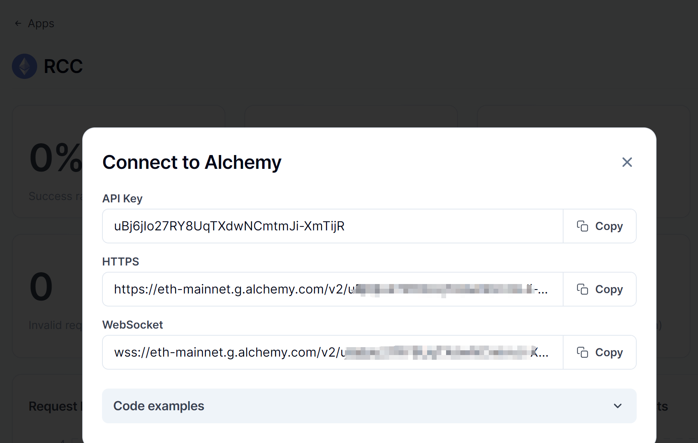
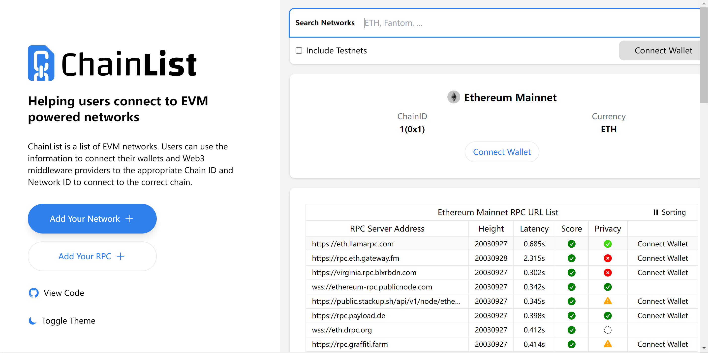
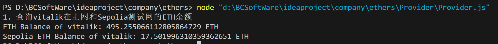
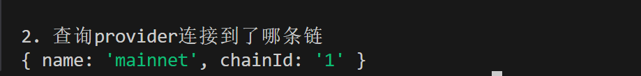
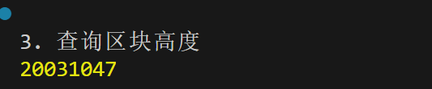
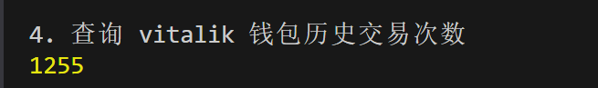
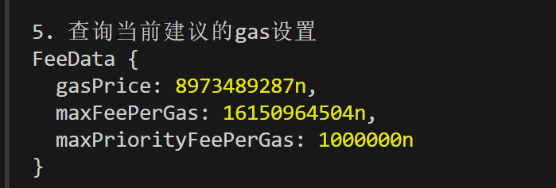
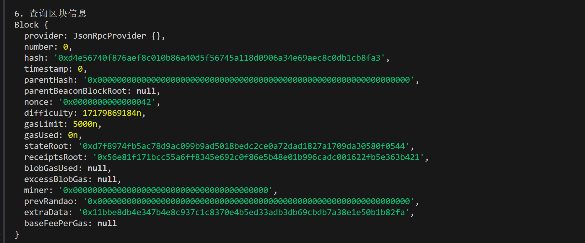
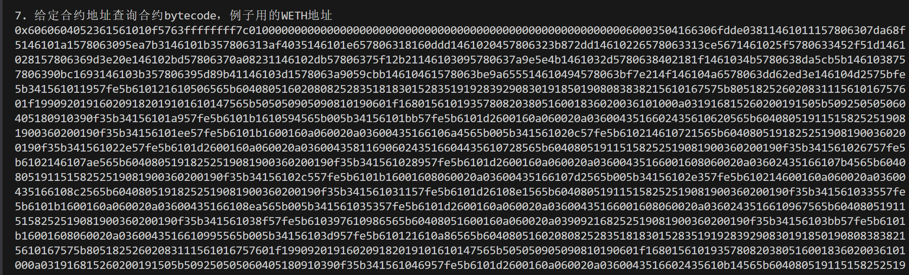

这一讲，我们将介绍 ethers.js 的 `Provider` 类，然后利用它连接上 Infura 节点，读取链上的信息。

## **Provider类**

`Provider` 类是对以太坊网络连接的抽象，为标准以太坊节点功能提供简洁、一致的接口。在 `ethers` 中，`Provider` 不接触用户私钥，只能读取链上信息，不能写入，这一点比 `web3.js` 要安全。

除了默认提供者 `defaultProvider` 以外，`ethers` 中最常用的是 `jsonRpcProvider`，可以让用户连接到特定节点服务商的节点。

## **jsonRpcProvider**

### **创建节点服务商的 API Key**

首先，你需要去节点服务商的网站注册并创建 `API Key`。在体验课部分我们介绍了<u>Infura</u>和<u>Alchemy</u>两家公司 `API Key` 的创建方法，大家可以参考。



你还可以在 <u>Chainlist</u> 网站找到各个链的公开节点。



### **连接公开节点**

这里，我们用<u>Chainlist</u>上的公开节点作为例子。在找到合适的 rpc 之后，可以利用 `ethers.JsonRpcProvider()` 方法来创建 `Provider` 变量，该方法以节点服务的 `url` 链接作为参数。

在下面这个例子中，我们分别创建连接到 `ETH` 主网和 `Sepolia` 测试网的 `provider`：

```javascript
// 利用公共rpc节点连接以太坊网络
// 可以在 https://chainlist.org 上找到
const ALCHEMY_MAINNET_URL = 'https://rpc.ankr.com/eth';
const ALCHEMY_SEPOLIA_URL = 'https://rpc.sepolia.org';
// 连接以太坊主网
const providerETH = new ethers.JsonRpcProvider(ALCHEMY_MAINNET_URL)
// 连接Sepolia测试网
const providerSepolia = new ethers.JsonRpcProvider(ALCHEMY_SEPOLIA_URL)
```

### **利用****Provider****读取链上数据**

`Provider` 类封装了一些方法，可以便捷的读取链上数据：

**1.** 利用 `getBalance()` 函数读取主网和测试网 Vitalik 的 `ETH` 余额（测试网目前不支持 `ENS` 域名，只能用钱包地址查询）：

```javascript
// 1. 查询vitalik在主网和Sepolia测试网的ETH余额
    console.log("1. 查询vitalik在主网和Sepolia测试网的ETH余额");
    const balance = await providerETH.getBalance(`vitalik.eth`);
    const balanceSepolia = await providerSepolia.getBalance(`0xd8dA6BF26964aF9D7eEd9e03E53415D37aA96045`);
    // 将余额输出在console（主网）
    console.log(`ETH Balance of vitalik: ${ethers.formatEther(balance)} ETH`);
    // 输出Sepolia测试网ETH余额
    console.log(`Sepolia ETH Balance of vitalik: ${ethers.formatEther(balanceSepolia)} ETH`);
```



完整代码

```javascript
const ethers = require('ethers');

// 利用公共rpc节点连接以太坊网络
// 可以在 https://chainlist.org 上找到
const ALCHEMY_MAINNET_URL = 'https://rpc.ankr.com/eth';
const ALCHEMY_SEPOLIA_URL = 'https://rpc.sepolia.org';
// 连接以太坊主网
const providerETH = new ethers.JsonRpcProvider(ALCHEMY_MAINNET_URL);
// 连接Sepolia测试网
const providerSepolia = new ethers.JsonRpcProvider(ALCHEMY_SEPOLIA_URL);

async function checkBalances() {
    // 1. 查询vitalik在主网和Sepolia测试网的ETH余额
    console.log("1. 查询vitalik在主网和Sepolia测试网的ETH余额");
    try {
        const balance = await providerETH.getBalance('vitalik.eth');
        const balanceSepolia = await providerSepolia.getBalance('0xd8dA6BF26964aF9D7eEd9e03E53415D37aA96045');
        // 将余额输出在console（主网）
        console.log(`ETH Balance of vitalik: ${ethers.formatEther(balance)} ETH`);
        // 输出Sepolia测试网ETH余额
        console.log(`Sepolia ETH Balance of vitalik: ${ethers.formatEther(balanceSepolia)} ETH`);
    } catch (error) {
        console.error("Error fetching balances:", error);
    }
}

// 调用函数
checkBalances();
```

**2.** 利用 `getNetwork()` 查询 `provider` 连接到了哪条链，`homestead` 代表 `ETH` 主网：

```javascript
// 2. 查询provider连接到了哪条链
    console.log("\n2. 查询provider连接到了哪条链")
    const network = await providerETH.getNetwork();
    console.log(network.toJSON());
```

> ethers v6 版本, 以上代码中 `network` 不能直接 `console.log()`



**3.** 利用 `getBlockNumber()` 查询当前区块高度：

```javascript
// 3. 查询区块高度
    console.log("\n3. 查询区块高度")
    const blockNumber = await providerETH.getBlockNumber();
    console.log(blockNumber);
```



**4.** 利用 `getTransactionCount()` 查询某个钱包的历史交易次数。

```javascript
// 4. 查询 vitalik 钱包历史交易次数
    console.log("\n4. 查询 vitalik 钱包历史交易次数")
    const txCount = await providerETH.getTransactionCount("vitalik.eth");
    console.log(txCount);
```



**5.** 利用 `getFeeData()` 查询当前建议的 `gas` 设置，返回的数据格式为 `bigint`。

```javascript
// 5. 查询当前建议的gas设置
    console.log("\n5. 查询当前建议的gas设置")
    const feeData = await providerETH.getFeeData();
    console.log(feeData);
```



**6.** 利用 `getBlock()` 查询区块信息，参数为要查询的区块高度：

```javascript
// 6. 查询区块信息
    console.log("\n6. 查询区块信息")
    const block = await providerETH.getBlock(0);
    console.log(block);
```



**7.** 利用 `getCode()` 查询某个地址的合约 `bytecode`，参数为合约地址，下面例子中用的主网 `WETH` 的合约地址：

```javascript
// 7. 给定合约地址查询合约bytecode，例子用的WETH地址
    console.log("\n7. 给定合约地址查询合约bytecode，例子用的WETH地址")
    const code = await providerETH.getCode("0xc778417e063141139fce010982780140aa0cd5ab");
    console.log(code);
```



完整代码

```javascript
const ethers = require('ethers');

// 利用公共rpc节点连接以太坊网络
// 可以在 https://chainlist.org 上找到
const ALCHEMY_MAINNET_URL = 'https://rpc.ankr.com/eth';
const ALCHEMY_SEPOLIA_URL = 'https://rpc.sepolia.org';
// 连接以太坊主网
const providerETH = new ethers.JsonRpcProvider(ALCHEMY_MAINNET_URL);
// 连接Sepolia测试网
const providerSepolia = new ethers.JsonRpcProvider(ALCHEMY_SEPOLIA_URL);

async function checkBalances() {
    // 1. 查询vitalik在主网和Sepolia测试网的ETH余额
    console.log("1. 查询vitalik在主网和Sepolia测试网的ETH余额");
    try {
        const balance = await providerETH.getBalance('vitalik.eth');
        const balanceSepolia = await providerSepolia.getBalance('0xd8dA6BF26964aF9D7eEd9e03E53415D37aA96045');
        // 将余额输出在console（主网）
        console.log(`ETH Balance of vitalik: ${ethers.formatEther(balance)} ETH`);
        // 输出Sepolia测试网ETH余额
clar
        // 2. 查询provider连接到了哪条链
        console.log("\n2. 查询provider连接到了哪条链")
        const network = await providerETH.getNetwork();
        console.log(network.toJSON());
        // 3. 查询区块高度
        console.log("\n3. 查询区块高度")
        const blockNumber = await providerETH.getBlockNumber();
        console.log(blockNumber);
            // 4. 查询 vitalik 钱包历史交易次数
        console.log("\n4. 查询 vitalik 钱包历史交易次数")
        const txCount = await providerETH.getTransactionCount("vitalik.eth");
        console.log(txCount);
            // 5. 查询当前建议的gas设置
        console.log("\n5. 查询当前建议的gas设置")
        const feeData = await providerETH.getFeeData();
        console.log(feeData);
            // 6. 查询区块信息
        console.log("\n6. 查询区块信息")
        const block = await providerETH.getBlock(0);
        console.log(block);
            // 7. 给定合约地址查询合约bytecode，例子用的WETH地址
        console.log("\n7. 给定合约地址查询合约bytecode，例子用的WETH地址")
        const code = await providerETH.getCode("0xc778417e063141139fce010982780140aa0cd5ab");
        console.log(code);
    } catch (error) {
        console.error("Error fetching balances:", error);
    }
}

// 调用函数
checkBalances();
```

console

```javascript
1. 查询vitalik在主网和Sepolia测试网的ETH余额
ETH Balance of vitalik: 495.255066112805864729 ETH
Sepolia ETH Balance of vitalik: 17.501996310359362651 ETH

2. 查询provider连接到了哪条链
{ name: 'mainnet', chainId: '1' }

3. 查询区块高度
20031071

4. 查询 vitalik 钱包历史交易次数
1255

5. 查询当前建议的gas设置
FeeData {
  gasPrice: 10007201615n,
  maxFeePerGas: 20635327462n,
  maxPriorityFeePerGas: 1000000n
}

6. 查询区块信息
Block {
  provider: JsonRpcProvider {},
  number: 0,
  hash: '0xd4e56740f876aef8c010b86a40d5f56745a118d0906a34e69aec8c0db1cb8fa3',
  timestamp: 0,
  parentHash: '0x0000000000000000000000000000000000000000000000000000000000000000',
  parentBeaconBlockRoot: null,
  nonce: '0x0000000000000042',
  difficulty: 17179869184n,
  gasLimit: 5000n,
  gasUsed: 0n,
  stateRoot: '0xd7f8974fb5ac78d9ac099b9ad5018bedc2ce0a72dad1827a1709da30580f0544',
  receiptsRoot: '0x56e81f171bcc55a6ff8345e692c0f86e5b48e01b996cadc001622fb5e363b421',
  blobGasUsed: null,
  excessBlobGas: null,
  miner: '0x0000000000000000000000000000000000000000',
  prevRandao: '0x0000000000000000000000000000000000000000000000000000000000000000',
  extraData: '0x11bbe8db4e347b4e8c937c1c8370e4b5ed33adb3db69cbdb7a38e1e50b1b82fa',
  baseFeePerGas: null
}

7. 给定合约地址查询合约bytecode，例子用的WETH地址
0x6060604052361561010f5763ffffffff7c010000000000000000000000000000000000000000000000000000000060003504166306fdde03811461011157806307da68f5146101a1578063095ea7b3146101b357806313af4035146101e657806318160ddd1461020457806323b872dd14610226578063313ce5671461025f5780633452f51d1461028157806369d3e20e146102bd57806370a08231146102db57806375f12b21146103095780637a9e5e4b1461032d5780638402181f1461034b5780638da5cb5b1461038757806390bc1693146103b357806395d89b41146103d1578063a9059cbb14610461578063be9a655514610494578063bf7e214f146104a6578063dd62ed3e146104d2575bfe5b341561011957fe5b610121610506565b604080516020808252835181830152835191928392908301918501908083838215610167575b80518252602083111561016757601f199092019160209182019101610147565b505050905090810190601f1680156101935780820380516001836020036101000a031916815260200191505b509250505060405180910390f35b34156101a957fe5b6101b1610594565b005b34156101bb57fe5b6101d2600160a060020a0360043516602435610620565b604080519115158252519081900360200190f35b34156101ee57fe5b6101b1600160a060020a03600435166106a4565b005b341561020c57fe5b610214610721565b60408051918252519081900360200190f35b341561022e57fe5b6101d2600160a060020a0360043581169060243516604435610728565b604080519115158252519081900360200190f35b341561026757fe5b6102146107ae565b60408051918252519081900360200190f35b341561028957fe5b6101d2600160a060020a03600435166001608060020a03602435166107b4565b604080519115158252519081900360200190f35b34156102c557fe5b6101b16001608060020a03600435166107d2565b005b34156102e357fe5b610214600160a060020a03600435166108c2565b60408051918252519081900360200190f35b341561031157fe5b6101d26108e1565b604080519115158252519081900360200190f35b341561033557fe5b6101b1600160a060020a03600435166108ea565b005b341561035357fe5b6101d2600160a060020a03600435166001608060020a0360243516610967565b604080519115158252519081900360200190f35b341561038f57fe5b610397610986565b60408051600160a060020a039092168252519081900360200190f35b34156103bb57fe5b6101b16001608060020a0360043516610995565b005b34156103d957fe5b610121610a86565b604080516020808252835181830152835191928392908301918501908083838215610167575b80518252602083111561016757601f199092019160209182019101610147565b505050905090810190601f1680156101935780820380516001836020036101000a031916815260200191505b509250505060405180910390f35b341561046957fe5b6101d2600160a060020a0360043516602435610b14565b604080519115158252519081900360200190f35b341561049c57fe5b6101b1610b98565b005b34156104ae57fe5b610397610c21565b60408051600160a060020a039092168252519081900360200190f35b34156104da57fe5b610214600160a060020a0360043581169060243516610c30565b60408051918252519081900360200190f35b6005805460408051602060026001851615610100026000190190941693909304601f8101849004840282018401909252818152929183018282801561058c5780601f106105615761010080835404028352916020019161058c565b820191906000526020600020905b81548152906001019060200180831161056f57829003601f168201915b505050505081565b6105b26105ad33600035600160e060020a031916610c5d565b610d65565b6040805134808252602082018381523693830184905260043593602435938493869333600160a060020a03169360008035600160e060020a031916949092606082018484808284376040519201829003965090945050505050a46008805460ff191660011790555b5b50505b565b6008546000906106339060ff1615610d65565b6040805134808252602082018381523693830184905260043593602435938493869333600160a060020a03169360008035600160e060020a031916949092606082018484808284376040519201829003965090945050505050a46106978585610d76565b92505b5b50505b92915050565b6106c26105ad33600035600160e060020a031916610c5d565b610d65565b6004805473ffffffffffffffffffffffffffffffffffffffff1916600160a060020a0383811691909117918290556040519116907fce241d7ca1f669fee44b6fc00b8eba2df3bb514eed0f6f668f8f89096e81ed9490600090a25b5b50565b6000545b90565b60085460009061073b9060ff1615610d65565b6040805134808252602082018381523693830184905260043593602435938493869333600160a060020a03169360008035600160e060020a031916949092606082018484808284376040519201829003965090945050505050a46107a0868686610de1565b92505b5b50505b9392505050565b60075481565b60006107c983836001608060020a0316610b14565b90505b92915050565b6107f06105ad33600035600160e060020a031916610c5d565b610d65565b6008546108009060ff1615610d65565b6040805134808252602082018381523693830184905260043593602435938493869333600160a060020a03169360008035600160e060020a031916949092606082018484808284376040519201829003965090945050505050a4600160a060020a03331660009081526001602052604090205461088a906001608060020a03851681011015610d65565b600160a060020a033316600090815260016020526040812080546001608060020a03861690810190915581540190555b5b50505b5b50565b600160a060020a0381166000908152600160205260409020545b919050565b60085460ff1681565b6109086105ad33600035600160e060020a031916610c5d565b610d65565b6003805473ffffffffffffffffffffffffffffffffffffffff1916600160a060020a0383811691909117918290556040519116907f1abebea81bfa2637f28358c371278fb15ede7ea8dd28d2e03b112ff6d936ada490600090a25b5b50565b60006107c98333846001608060020a0316610728565b90505b92915050565b600454600160a060020a031681565b6109b36105ad33600035600160e060020a031916610c5d565b610d65565b6008546109c39060ff1615610d65565b6040805134808252602082018381523693830184905260043593602435938493869333600160a060020a03169360008035600160e060020a031916949092606082018484808284376040519201829003965090945050505050a4600160a060020a033316600090815260016020526040902054610a4d906001608060020a03851681031115610d65565b600160a060020a033316600090815260016020526040812080546001608060020a0386169081900390915581540390555b5b50505b5b50565b6006805460408051602060026001851615610100026000190190941693909304601f8101849004840282018401909252818152929183018282801561058c5780601f106105615761010080835404028352916020019161058c565b820191906000526020600020905b81548152906001019060200180831161056f57829003601f168201915b505050505081565b600854600090610b279060ff1615610d65565b6040805134808252602082018381523693830184905260043593602435938493869333600160a060020a03169360008035600160e060020a031916949092606082018484808284376040519201829003965090945050505050a46106978585610ef4565b92505b5b50505b92915050565b610bb66105ad33600035600160e060020a031916610c5d565b610d65565b6040805134808252602082018381523693830184905260043593602435938493869333600160a060020a03169360008035600160e060020a031916949092606082018484808284376040519201829003965090945050505050a46008805460ff191690555b5b50505b565b600354600160a060020a031681565b600160a060020a038083166000908152600260209081526040808320938516835292905220545b92915050565b600030600160a060020a031683600160a060020a03161415610c815750600161069e565b600454600160a060020a0384811691161415610c9f5750600161069e565b600354600160a060020a03161515610cb95750600061069e565b600354604080516000602091820181905282517fb7009613000000000000000000000000000000000000000000000000000000008152600160a060020a0388811660048301523081166024830152600160e060020a0319881660448301529351939094169363b7009613936064808301949391928390030190829087803b1515610d3f57fe5b6102c65a03f11515610d4d57fe5b505060405151915061069e9050565b5b5b5b92915050565b80151561071d5760006000fd5b5b50565b600160a060020a03338116600081815260026020908152604080832094871680845294825280832086905580518681529051929493927f8c5be1e5ebec7d5bd14f71427d1e84f3dd0314c0f7b2291e5b200ac8c7c3b925929181900390910190a35060015b92915050565b600160a060020a038316600090815260016020526040812054610e079083901015610d65565b600160a060020a0380851660009081526002602090815260408083203390941683529290522054610e3b9083901015610d65565b600160a060020a038316600090815260016020526040902054610e67906105ad9084610fb7565b610d65565b600160a060020a03808516600081815260026020908152604080832033861684528252808320805488900390558383526001825280832080548890039055938716808352918490208054870190558351868152935191937fddf252ad1be2c89b69c2b068fc378daa952ba7f163c4a11628f55a4df523b3ef929081900390910190a35060015b9392505050565b600160a060020a033316600090815260016020526040812054610f1a9083901015610d65565b600160a060020a038316600090815260016020526040902054610f46906105ad9084610fb7565b610d65565b600160a060020a03338116600081815260016020908152604080832080548890039055938716808352918490208054870190558351868152935191937fddf252ad1be2c89b69c2b068fc378daa952ba7f163c4a11628f55a4df523b3ef929081900390910190a35060015b92915050565b808201829010155b929150505600a165627a7a723058202c338bb3d0c86b4d03a42df2ad24f83dbd41c3d87dbcd59296451a3a0c1683c70029
```

## **总结**

这一讲，我们介绍了 ethers.js 的 `Provider` 类，并用 Infura 的节点 API Key 创建了 `jsonRpcProvider`，读取了 `ETH` 主网和 `Sepolia` 测试网的链上信息。
