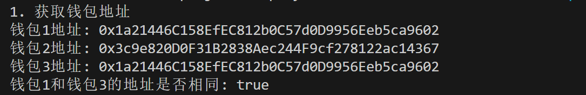
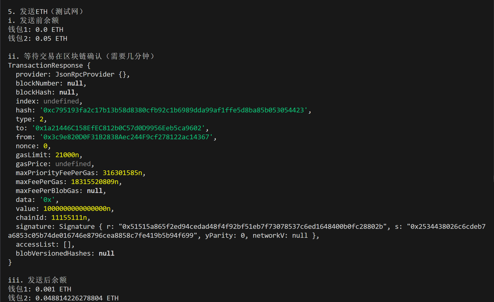

这一讲，我们将介绍 `Signer` 签名者类和它派生的 `Wallet` 钱包类，并利用它来发送 `ETH`。

## **Signer签名者类**

`Web3.js` 认为用户会在本地部署以太坊节点，私钥和网络连接状态由这个节点管理（实际并不是这样）；而在 `ethers.js` 中，`Provider` 提供器类管理网络连接状态，`Signer` 签名者类或 `Wallet` 钱包类管理密钥，安全且灵活。

在 `ethers` 中，`Signer` 签名者类是以太坊账户的抽象，可用于对消息和交易进行签名，并将签名的交易发送到以太坊网络，并更改区块链状态。`Signer` 类是抽象类，不能直接实例化，我们需要使用它的子类：`Wallet` 钱包类。

## **Wallet钱包类**

`Wallet` 类继承了 `Signer` 类，并且开发者可以像包含私钥的外部拥有帐户（`EOA`）一样，用它对交易和消息进行签名。

下面我们介绍创建 `Wallet` 实例的几种办法：

### **方法 1：创建随机的 wallet 对象**

我们可以利用 `ethers.Wallet.createRandom()` 函数创建带有随机私钥的 `Wallet` 对象。该私钥由加密安全的熵源生成，如果当前环境没有安全的熵源，则会引发错误

```javascript
// 创建随机的wallet对象
const wallet1 = ethers.Wallet.createRandom()
```

### **方法 2：用私钥创建 wallet 对象**

我们已知私钥的情况下，可以利用 `ethers.Wallet()` 函数创建 `Wallet` 对象。

```javascript
// 利用私钥和provider创建wallet对象
const privateKey = '0f03a73988c990c2333bbbcd99d442377fedbe48083a8a9c4426ace223c33e5d'
const wallet2 = new ethers.Wallet(privateKey, provider)
```

### **方法 3：从助记词创建 wallet 对象**

我们已知助记词的情况下，可以利用 `ethers.Wallet.fromPhrase()` 函数创建 `Wallet` 对象。

```javascript
// 从助记词创建wallet对象
const wallet3 = ethers.Wallet.fromPhrase(mnemonic.phrase)
```

### **其他方法：通过 JSON 文件创建 wallet 对象**

以上三种方法即可满足大部分需求，当然还可以通过 `ethers.Wallet.fromEncryptedJson` 解密一个 `JSON` 钱包文件创建钱包实例，`JSON` 文件即 `keystore` 文件，通常来自 `Geth`, `Parity` 等钱包，通过 `Geth` 搭建过以太坊节点的个人对 `keystore` 文件不会陌生。

## **发送ETH**

我们可以利用 `Wallet` 实例来发送 `ETH`。首先，我们要构造一个交易请求，在里面声明接收地址 `to` 和发送的 `ETH` 数额 `value`。交易请求 `TransactionRequest` 类型可以包含发送方 `from`，nonce 值 `nounce`，请求数据 `data` 等信息，之后的教程里会更详细介绍。

```javascript
// 创建交易请求，参数：to为接收地址，value为ETH数额
    const tx = {
        to: address1,
        value: ethers.parseEther("0.001")
    }
```

然后，我们就可以利用 `Wallet` 类的 `sendTransaction` 来发送交易，等待交易上链，并获得交易的收据，非常简单。

```javascript
//发送交易，获得收据
    const txRes = await wallet2.sendTransaction(tx)
    const receipt = await txRes.wait() // 等待链上确认交易
    console.log(receipt) // 打印交易的收据
```

## **代码示例**

1. **创建****Provider****实例**

```javascript
// 利用Wallet类发送ETH

const ethers = require('ethers').ethers;

// 利用Alchemy的rpc节点连接以太坊测试网络

const ALCHEMY_SEPOLIA_URL = 'https://eth-sepolia.g.alchemy.com/v2/...';
const provider = new ethers.JsonRpcProvider(ALCHEMY_SEPOLIA_URL);
```

2. **用三种不同方法创建****Wallet****实例**

- 创建随机私钥的 `Wallet` 对象。这种方法创建的钱包是单机的，我们需要用 `connect(provider)` 函数，连接到以太坊节点。这种方法创建的钱包可以用 `mnemonic` 获取助记词。

```javascript
// 创建随机的wallet对象
const wallet1 = ethers.Wallet.createRandom()
const wallet1WithProvider = wallet1.connect(provider)
const mnemonic = wallet1.mnemonic // 获取助记词
```

- 利用私钥和 `Provider` 实例创建 `Wallet` 对象。这种方法创建的钱包不能获取助记词。

```javascript
// 利用私钥和provider创建wallet对象
//私钥可以用自己的私钥，这里案例的私钥里面没有测试eth
const privateKey = '0f03a73988c990c2333bbbcd99d442377fedbe48083a8a9c4426ace223c33e5d'
const wallet2 = new ethers.Wallet(privateKey, provider)
```

- 利用助记词创建 `Wallet` 对象。这里我们使用的是 `wallet1` 的助记词，因此创建出钱包的私钥和公钥都和 `wallet1` 相同。

```javascript
// 从助记词创建wallet对象
const wallet3 = ethers.Wallet.fromPhrase(mnemonic.phrase)
```

3. **获取钱包地址**

利用 `getAddress()` 函数获取钱包地址。

```javascript
const address1 = await wallet1.getAddress()
    const address2 = await wallet2.getAddress() 
    const address3 = await wallet3.getAddress() // 获取地址
    console.log(`1. 获取钱包地址`);
    console.log(`钱包1地址: ${address1}`);
    console.log(`钱包2地址: ${address2}`);
    console.log(`钱包3地址: ${address3}`);
    console.log(`钱包1和钱包3的地址是否相同: ${address1 === address3}`);
```



4. **获取助记词**

利用钱包对象的 `mnemonic.phrase` 成员获取助记词：

```javascript
console.log(`钱包1助记词: ${wallet1.mnemonic.phrase}`)
```


5. **获取私钥**

利用钱包对象的 `privateKey` 成员获取私钥：

```javascript
console.log(`钱包2私钥: ${wallet2.privateKey}`)
```


6. **获取钱包在链上的交互次数**

利用 `getTransactionCount()` 函数获取钱包在链上的交互次数。

```javascript
const txCount1 = await provider.getTransactionCount(wallet1WithProvider)
    const txCount2 = await provider.getTransactionCount(wallet2)
    console.log(`钱包1发送交易次数: ${txCount1}`)
    console.log(`钱包2发送交易次数: ${txCount2}`)
```


7. **发送ETH**

我们用 `wallet2` 给 `wallet1` 发送 `0.001 ETH`，并打印交易前后的钱包余额。由于 `wallet1` 是新建的随机私钥钱包，因此交易前余额为 `0`，而交易后余额为 `0.001 ETH`。

```javascript
// 5. 发送ETH
    // 如果这个钱包没sepolia测试网ETH了，去水龙头领一些
    // 1. https://faucets.chain.link/
  
    console.log(`\n5. 发送ETH（测试网）`);
    // i. 打印交易前余额
    console.log(`i. 发送前余额`)
    console.log(`钱包1: ${ethers.formatEther(await provider.getBalance(wallet1WithProvider))} ETH`)
    console.log(`钱包2: ${ethers.formatEther(await provider.getBalance(wallet2))} ETH`)
    // ii. 构造交易请求，参数：to为接收地址，value为ETH数额
    const tx = {
        to: address1,
        value: ethers.parseEther("0.001")
    }
    // iii. 发送交易，获得收据
    console.log(`\nii. 等待交易在区块链确认（需要几分钟）`)
    const receipt = await wallet2.sendTransaction(tx)
    await receipt.wait() // 等待链上确认交易
    console.log(receipt) // 打印交易详情
    // iv. 打印交易后余额
    console.log(`\niii. 发送后余额`)
    console.log(`钱包1: ${ethers.formatEther(await provider.getBalance(wallet1WithProvider))} ETH`)
    console.log(`钱包2: ${ethers.formatEther(await provider.getBalance(wallet2))} ETH`)
```



完整代码

```javascript
const ethers = require('ethers');

// 利用Alchemy的rpc节点连接以太坊测试网络
const ALCHEMY_SEPOLIA_URL = 'https://eth-sepolia.g.alchemy.com/v2/...';
const provider = new ethers.JsonRpcProvider(ALCHEMY_SEPOLIA_URL);

// 创建随机的wallet对象
const wallet1 = ethers.Wallet.createRandom();
const wallet1WithProvider = wallet1.connect(provider);
const mnemonic = wallet1.mnemonic; // 获取助记词

// 利用私钥和provider创建wallet对象
const privateKey = '0f03a73988c990c2333bbbcd99d442377fedbe48083a8a9c4426ace223c33e5d';
const wallet2 = new ethers.Wallet(privateKey, provider);

// 从助记词创建wallet对象
const wallet3 = ethers.Wallet.fromPhrase(mnemonic.phrase);

async function getWalletAddresses() {
    const address1 = await wallet1WithProvider.getAddress();
    const address2 = await wallet2.getAddress();
    const address3 = await wallet3.getAddress();

    console.log(`1. 获取钱包地址`);
    console.log(`钱包1地址: ${address1}`);
    console.log(`钱包2地址: ${address2}`);
    console.log(`钱包3地址: ${address3}`);
    console.log(`钱包1和钱包3的地址是否相同: ${address1 === address3}`);
    console.log(`钱包1助记词: ${wallet1.mnemonic.phrase}`)
    console.log(`钱包2私钥: ${wallet2.privateKey}`)
    const txCount1 = await provider.getTransactionCount(wallet1WithProvider)
    const txCount2 = await provider.getTransactionCount(wallet2)
    console.log(`钱包1发送交易次数: ${txCount1}`)
    console.log(`钱包2发送交易次数: ${txCount2}`)
 // 5. 发送ETH
    // 如果这个钱包没sepolia测试网ETH了，去水龙头领一些，钱包地址: 0xe16C1623c1AA7D919cd2241d8b36d9E79C1Be2A2
    // 1. https://faucets.chain.link/
    console.log(`\n5. 发送ETH（测试网）`);
    // i. 打印交易前余额
    console.log(`i. 发送前余额`)
    console.log(`钱包1: ${ethers.formatEther(await provider.getBalance(wallet1WithProvider))} ETH`)
    console.log(`钱包2: ${ethers.formatEther(await provider.getBalance(wallet2))} ETH`)
    // ii. 构造交易请求，参数：to为接收地址，value为ETH数额
    const tx = {
        to: address1,
        value: ethers.parseEther("0.001")
    }
    // iii. 发送交易，获得收据
    console.log(`\nii. 等待交易在区块链确认（需要几分钟）`)
    const receipt = await wallet2.sendTransaction(tx)
    await receipt.wait() // 等待链上确认交易
    console.log(receipt) // 打印交易详情
    // iv. 打印交易后余额
    console.log(`\niii. 发送后余额`)
    console.log(`钱包1: ${ethers.formatEther(await provider.getBalance(wallet1WithProvider))} ETH`)
    console.log(`钱包2: ${ethers.formatEther(await provider.getBalance(wallet2))} ETH`)
}

getWalletAddresses();
```

Console

```javascript
1. 获取钱包地址
钱包1地址: 0x1a21446C158EfEC812b0C57d0D9956Eeb5ca9602
钱包2地址: 0x3c9e820D0F31B2838Aec244F9cf278122ac14367
钱包3地址: 0x1a21446C158EfEC812b0C57d0D9956Eeb5ca9602
钱包1和钱包3的地址是否相同: true
钱包1助记词: mercy stamp chuckle explain police scrap gravity empower chef brief monitor document
钱包2私钥: 0x0f03a73988c990c2333bbbcd99d442377fedbe48083a8a9c4426ace223c33e5d
钱包1发送交易次数: 0
钱包2发送交易次数: 0

5. 发送ETH（测试网）
i. 发送前余额
钱包1: 0.0 ETH
钱包2: 0.05 ETH

ii. 等待交易在区块链确认（需要几分钟）
TransactionResponse {
  provider: JsonRpcProvider {},
  blockNumber: null,
  blockHash: null,
  index: undefined,
  hash: '0xc795193fa2c17b13b58d8380cfb92c1b6989dda99af1ffe5d8ba85b053054423',
  type: 2,
  to: '0x1a21446C158EfEC812b0C57d0D9956Eeb5ca9602',
  from: '0x3c9e820D0F31B2838Aec244F9cf278122ac14367',
  nonce: 0,
  gasLimit: 21000n,
  gasPrice: undefined,
  maxPriorityFeePerGas: 316301585n,
  maxFeePerGas: 18315520809n,
  maxFeePerBlobGas: null,
  data: '0x',
  value: 1000000000000000n,
  chainId: 11155111n,
  signature: Signature { r: "0x51515a865f2ed94cedad48f4f92bf51eb7f73078537c6ed1648400b0fc28802b", s: "0x2534438026c6cdeb7a6853c05b74de016746e8796cea8858c7fe419b5b94f699", yParity: 0, networkV: null },
  accessList: [],
  blobVersionedHashes: null
}

iii. 发送后余额
钱包1: 0.001 ETH
钱包2: 0.048814226278804 ETH
```

## **总结**

这一讲，我们介绍了 `Signer` 签名者类和 `Wallet` 钱包类，使用钱包实例获取了地址、助记词、私钥、链上交互次数，并发送 `ETH`。
