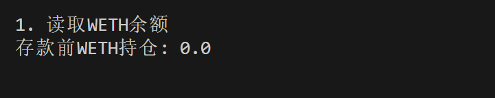
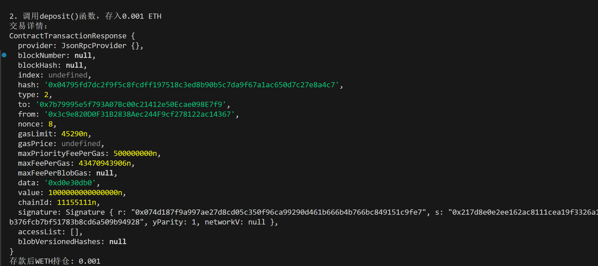
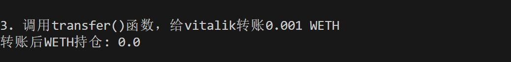

这一讲，我们将介绍如何声明可写的 `Contract` 合约变量

## **创建可写****Contract****变量**

声明可写的 `Contract` 变量的规则：

```javascript
const contract = new ethers.Contract(address, abi, signer)
```

其中 `address` 为合约地址，`abi` 是合约的 `abi` 接口，`signer` 是 `wallet` 对象。注意，这里你需要提供 `signer`，而在声明可读合约时你只需要提供 `provider`。

你也可以利用下面的方法，将可读合约转换为可写合约：

```javascript
const contract2 = contract.connect(signer)
```

## **合约交互**

我们在第三讲介绍了读取合约信息。它不需要 `gas`。这里我们介绍写入合约信息，你需要构建交易，并且支付 `gas`。该交易将由整个网络上的每个节点以及矿工验证，并改变区块链状态。

你可以用下面的方法进行合约交互：

```javascript
// 发送交易
const tx = await contract.METHOD_NAME(args [, overrides])
// 等待链上确认交易
await tx.wait()
```

其中 `METHOD_NAME` 为调用的函数名，`args` 为函数参数，`[, overrides]` 是可以选择传入的数据，包括：

- gasPrice：gas 价格
- gasLimit：gas 上限
- value：调用时传入的 ether（单位是 wei）
- nonce：nonce

**注意：** 此方法不能获取合约运行的返回值，如有需要，要使用 `Solidity` 事件记录，然后利用交易收据去查询。

## **例子：与测试网****WETH****合约交互**

`WETH` (Wrapped ETH)是 `ETH` 的带包装版本，将以太坊原生代币用智能合约包装成了符合 `ERC20` 的代币。

1. 创建 `provider`，`wallet` 变量。

```javascript
const ethers = require('ethers');
// 利用Alchemy的rpc节点连接以太坊测试网络
const ALCHEMY_SEPOLIA_URL = 'https://eth-sepolia.g.alchemy.com/v2/....';
const provider = new ethers.JsonRpcProvider(ALCHEMY_SEPOLIA_URL);

// 利用私钥和provider创建wallet对象(建议用自己的钱包私钥)
const privateKey = '0f03a73988c990c2333bbbcd99d442377fedbe48083a8a9c4426ace223c33e5d'
const wallet = new ethers.Wallet(privateKey, provider)
```

2. 创建可写 `WETH` 合约变量，我们在 `ABI` 中加入了 4 个我们要调用的函数：
   - `balanceOf(address)`：查询地址的 `WETH` 余额。
   - `deposit()`：将转入合约的 `ETH` 转为 `WETH`。
   - `transfer(address, uint256)`：转账。
   - `withdraw(uint256)`：取款。

```javascript
// WETH的ABI
const abiWETH = [
    "function balanceOf(address) public view returns(uint)",
    "function deposit() public payable",
    "function transfer(address, uint) public returns (bool)",
    "function withdraw(uint) public",
];
// WETH合约地址（sepolia测试网）
const addressWETH = '0x7b79995e5f793a07bc00c21412e50ecae098e7f9'
// WETH Contract

// 声明可写合约
const contractWETH = new ethers.Contract(addressWETH, abiWETH, wallet)
// 也可以声明一个只读合约，再用connect(wallet)函数转换成可写合约。
// const contractWETH = new ethers.Contract(addressWETH, abiWETH, provider)
// contractWETH.connect(wallet)
```

3. 读取账户 `WETH` 余额，可以看到余额为 `0`。

```javascript
const address = await wallet.getAddress()
// 读取WETH合约的链上信息（WETH abi）
console.log("\n1. 读取WETH余额")
const balanceWETH = await contractWETH.balanceOf(address)
console.log(`存款前WETH持仓: ${ethers.formatEther(balanceWETH)}\n`)
```



4. 调用 `WETH` 合约的 `deposit()` 函数，将 `0.001 ETH` 转换为 `0.001 WETH`，打印交易详情和余额。`deposit()` 函数没有参数，可以看到余额变为 `0.001`。

```javascript
console.log("\n2. 调用desposit()函数，存入0.001 ETH")
    // 发起交易
    const tx = await contractWETH.deposit({value: ethers.parseEther("0.001")})
    // 等待交易上链
    await tx.wait()
    console.log(`交易详情：`)
    console.log(tx)
    const balanceWETH_deposit = await contractWETH.balanceOf(address)
    console.log(`存款后WETH持仓: ${ethers.formatEther(balanceWETH_deposit)}\n`)
```



5. 调用 `WETH` 合约的 `transfer()` 函数，给 Vitalik 转账 `0.001 WETH`，并打印余额。可以看到余额变为 `0` 。

```javascript
console.log("\n3. 调用transfer()函数，给vitalik转账0.001 WETH")
    // 发起交易
    const tx2 = await contractWETH.transfer("vitalik.eth", ethers.parseEther("0.001"))
    // 等待交易上链
    await tx2.wait()
    const balanceWETH_transfer = await contractWETH.balanceOf(address)
    console.log(`转账后WETH持仓: ${ethers.formatEther(balanceWETH_transfer)}\n`)
```



**注意**：观察 `deposit()` 函数和 `balanceOf()` 函数，为什么他们的返回值不一样？为什么前者返回一堆数据，而后者只返回确定的值？这是因为对于钱包的余额，它是一个只读操作，读到什么就是什么。而对于一次函数的调用，并不知道数据何时上链，所以只会返回这次交易的信息。总结来说，就是对于非 `pure`/`view` 函数的调用，会返回交易的信息。如果想知道函数执行过程中合约变量的变化，可以在合约中使用 `emit` 输出事件，并在返回的 `transaction` 信息中读取事件信息来获取相应的值。

## **总结**

这一讲，我们介绍了如何声明可写的 `Contract` 合约变量，并利用它与测试网的 `WETH` 合约交互。我们不仅调用 `WETH` 的 `deposit()` 函数，将 `0.001 ETH` 转换为 `WETH`，并转账给了 Vitalik。
