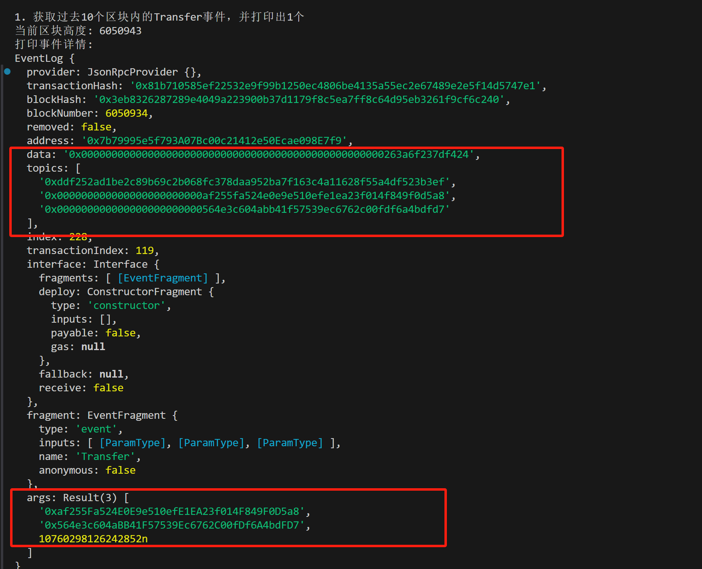
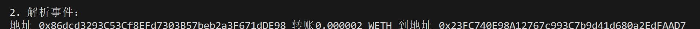

## **事件 Event**

智能合约释放出的事件存储于以太坊虚拟机的日志中。日志分为两个主题 `topics` 和数据 `data` 部分，其中事件哈希和 `indexed` 变量存储在 `topics` 中，作为索引方便以后搜索；没有 `indexed` 变量存储在 `data` 中，不能被直接检索，但可以存储更复杂的数据结构。

以 ERC20 代币中的 `Transfer` 转账事件为例，在合约中它是这样声明的：

```
event Transfer(address indexed from, address indexed to, uint256 amount);
```

它共记录了 3 个变量 `from`，`to` 和 `amount`，分别对应代币的发出地址，接收地址和转账数量，其中 `from` 和 `to` 前面带有 `indexed` 关键字。转账时，`Transfer` 事件会被记录，可以在 `etherscan` 中查到。


从上图中可以看到，`Transfer` 事件被记录到了 EVM 的日志中，其中 `Topics` 包含 3 个数据，分别对应事件哈希，发出地址 `from`，和接收地址 `to`；而 `Data` 中包含一个数据，对应转账数额 `amount`。

## **检索事件**

我们可以利用 `Ethers` 中合约类型的 `queryFilter()` 函数读取合约释放的事件。

```
const transferEvents = await contract.queryFilter('事件名', 起始区块, 结束区块)
```

`queryFilter()` 包含 3 个参数，分别是事件名（必填），起始区块（选填），和结束区块（选填）。检索结果会以数组的方式返回。

**注意**：要检索的事件必须包含在合约的 `abi` 中。

## **例子：检索****WETH****合约中的****Transfer****事件**

1. 创建 `provider`。

```
import { ethers } from "ethers";
// 利用Alchemy的rpc节点连接以太坊网络

const ALCHEMY_SEPOLIA_URL = 'https://eth-sepolia.g.alchemy.com/v2/AXHpaLX8ZTChuTuSlYTE2ivJBbuPz1_B';
const provider = new ethers.JsonRpcProvider(ALCHEMY_SEPOLIA_URL);
```

2. 创建包含检索事件的 `abi`。

```
// WETH ABI，只包含我们关心的Transfer事件
const abiWETH = [
    "event Transfer(address indexed from, address indexed to, uint amount)"
];
```

3. 声明 `WETH` 合约实例。

```
// 测试网WETH地址
const addressWETH = '0x7b79995e5f793a07bc00c21412e50ecae098e7f9'
// 声明合约实例
const contract = new ethers.Contract(addressWETH, abiWETH, provider)
```

4. 获取过去 10 个区块内的 `Transfer` 事件，并打印出 1 个。我们可以看到，`topics` 中有 3 个数据，对应事件哈希，`from`，和 `to`；而 `data` 中只有一个数据 `amount`。另外，`ethers` 还会根据 `ABI` 自动解析事件，结果显示在 `args` 成员中。

```
// 得到当前block
const block = await provider.getBlockNumber()
console.log(`当前区块高度: ${block}`);
console.log(`打印事件详情:`);
const transferEvents = await contract.queryFilter('Transfer', block - 10, block)
// 打印第1个Transfer事件
console.log(transferEvents[0])
```



5. 读取事件的解析结果。

```
// 解析Transfer事件的数据（变量在args中）
console.log("\n2. 解析事件：")
const amount = ethers.formatUnits(ethers.getBigInt(transferEvents[0].args["amount"]), "ether");
console.log(`地址 ${transferEvents[0].args["from"]} 转账${amount} WETH 到地址 ${transferEvents[0].args["to"]}`)
```



完整代码

```
// 检索事件的方法：
// const transferEvents = await contract.queryFilter("事件名", [起始区块高度，结束区块高度])
// 其中起始区块高度和结束区块高度为选填参数。
const ethers = require('ethers');
// 利用Alchemy的rpc节点连接以太坊测试网络
const ALCHEMY_SEPOLIA_URL = 'https://eth-sepolia.g.alchemy.com/v2/....';
const provider = new ethers.JsonRpcProvider(ALCHEMY_SEPOLIA_URL);

// WETH ABI，只包含我们关心的Transfer事件
const abiWETH = [
    "event Transfer(address indexed from, address indexed to, uint amount)"
];

// 测试网WETH地址
const addressWETH = '0x7b79995e5f793a07bc00c21412e50ecae098e7f9'
// 声明合约实例
const contract = new ethers.Contract(addressWETH, abiWETH, provider)

const main = async () => {

    // 获取过去10个区块内的Transfer事件
    console.log("\n1. 获取过去10个区块内的Transfer事件，并打印出1个");
    // 得到当前block
    const block = await provider.getBlockNumber()
    console.log(`当前区块高度: ${block}`);
    console.log(`打印事件详情:`);
    const transferEvents = await contract.queryFilter('Transfer', block - 10, block)
    // 打印第1个Transfer事件
    console.log(transferEvents[0])

    // 解析Transfer事件的数据（变量在args中）
    console.log("\n2. 解析事件：")
    const amount = ethers.formatUnits(ethers.getBigInt(transferEvents[0].args["amount"]), "ether");
    console.log(`地址 ${transferEvents[0].args["from"]} 转账${amount} WETH 到地址 ${transferEvents[0].args["to"]}`)
}

main()
```

Console

```
1. 获取过去10个区块内的Transfer事件，并打印出1个
当前区块高度: 6050967
打印事件详情:
EventLog {
  provider: JsonRpcProvider {},
  transactionHash: '0x942abafde69ba7ae75d9f247c6f9fb1248fcf2d9c0518cc2626937729055cda1',
  blockHash: '0x3673772feba78d5769604fdd647dc0c40ccd5bfad08e372946a3b68d86b7715a',
  blockNumber: 6050960,
  removed: false,
  address: '0x7b79995e5f793A07Bc00c21412e50Ecae098E7f9',
  data: '0x000000000000000000000000000000000000000000000000000001d1a94a2000',
  topics: [
    '0xddf252ad1be2c89b69c2b068fc378daa952ba7f163c4a11628f55a4df523b3ef',
    '0x00000000000000000000000086dcd3293c53cf8efd7303b57beb2a3f671dde98',
    '0x00000000000000000000000023fc740e98a12767c993c7b9d41d680a2edfaad7'
  ],
  index: 77,
  transactionIndex: 46,
  interface: Interface {
    fragments: [ [EventFragment] ],
    deploy: ConstructorFragment {
      type: 'constructor',
      inputs: [],
      payable: false,
      gas: null
    },
    fallback: null,
    receive: false
  },
  fragment: EventFragment {
    type: 'event',
    inputs: [ [ParamType], [ParamType], [ParamType] ],
    name: 'Transfer',
    anonymous: false
  },
  args: Result(3) [
    '0x86dcd3293C53Cf8EFd7303B57beb2a3F671dDE98',
    '0x23FC740E98A12767c993C7b9d41d680a2EdFAAD7',
    2000000000000n
  ]
}

2. 解析事件：
地址 0x86dcd3293C53Cf8EFd7303B57beb2a3F671dDE98 转账0.000002 WETH 到地址 0x23FC740E98A12767c993C7b9d41d680a2EdFAAD7
```

## **总结**

这一讲，我们回顾了 `Solidity` 中的事件，并介绍如何用 `ethers` 检索智能合约释放的事件。要注意的一点：要检索的事件必须包含在合约 `abi` 中。
