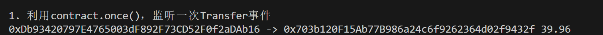
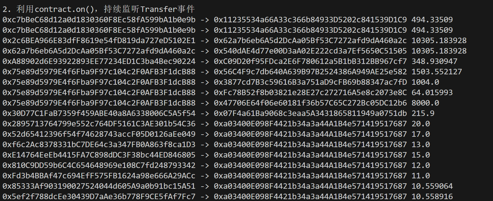

## **监听合约事件**

### **contract.on**

在 `ethers.js` 中，合约对象有一个 `contract.on` 的监听方法，让我们持续监听合约的事件：

```javascript
contract.on("eventName", function)
```

`contract.on` 有两个参数，一个是要监听的事件名称 `"eventName"`，需要包含在合约 `abi` 中；另一个是我们在事件发生时调用的函数。

### **contract.once**

合约对象有一个 `contract.once` 的监听方法，让我们只监听一次合约释放事件，它的参数与 `contract.on` 一样：

```javascript
contract.once("eventName", function)
```

## **监听****USDT****合约**

1. 声明 `provider`：Alchemy 是一个免费的 ETH 节点提供商。需要先申请一个，后续会用到。

```javascript
const ethers = require('ethers');
// 准备 alchemy API  
// 可以参考https://github.com/AmazingAng/WTFSolidity/blob/main/Topics/Tools/TOOL04_Alchemy/readme.md 
const ALCHEMY_MAINNET_URL = 'https://eth-mainnet.g.alchemy.com/v2/...';
// 连接主网 provider
const provider = new ethers.JsonRpcProvider(ALCHEMY_MAINNET_URL);
```

2. 声明合约变量：我们只关心 `USDT` 合约的 `Transfer` 事件，把它填入到 `abi` 中就可以。如果你关心其他函数和事件的话，可以在<u>etherscan</u>上找到。

```javascript
// USDT的合约地址
const contractAddress = '0xdac17f958d2ee523a2206206994597c13d831ec7'
// 构建USDT的Transfer的ABI
const abi = [
  "event Transfer(address indexed from, address indexed to, uint value)"
];
// 生成USDT合约对象
const contractUSDT = new ethers.Contract(contractAddress, abi, provider);
```

3. 利用 `contract.once()` 函数，监听一次 `Transfer` 事件，并打印结果。

```javascript
// 只监听一次
  console.log("\n1. 利用contract.once()，监听一次Transfer事件");
  contractUSDT.once('Transfer', (from, to, value)=>{
    // 打印结果
    console.log(
      `${from} -> ${to} ${ethers.formatUnits(ethers.getBigInt(value),6)}`
    )
  })
```



4. 利用 `contract.on()` 函数，持续监听 `Transfer` 事件，并打印结果。

```javascript
// 持续监听USDT合约
  console.log("\n2. 利用contract.on()，持续监听Transfer事件");
  contractUSDT.on('Transfer', (from, to, value)=>{
    console.log(
     // 打印结果
     `${from} -> ${to} ${ethers.formatUnits(ethers.getBigInt(value),6)}`
    )
  })
```



完整代码

```javascript
// 监听合约方法：
// 1. 持续监听
// contractUSDT.on("事件名", Listener)
// 2. 只监听一次
// contractUSDT.once("事件名", Listener)
const ethers = require('ethers');
// 利用Alchemy的rpc节点连接以太坊主网网络
const ALCHEMY_MAINNET_URL = 'https://eth-mainnet.g.alchemy.com/v2/...';
const provider = new ethers.JsonRpcProvider(ALCHEMY_MAINNET_URL);

// USDT的合约地址
const contractAddress = '0xdac17f958d2ee523a2206206994597c13d831ec7'
// 构建USDT的Transfer的ABI
const abi = [
  "event Transfer(address indexed from, address indexed to, uint value)"
];
// 生成USDT合约对象
const contractUSDT = new ethers.Contract(contractAddress, abi, provider);

const main = async () => {
  // 监听USDT合约的Transfer事件

  try{
    // 只监听一次
    console.log("\n1. 利用contract.once()，监听一次Transfer事件");
    contractUSDT.once('Transfer', (from, to, value)=>{
      // 打印结果
      console.log(
        `${from} -> ${to} ${ethers.formatUnits(ethers.getBigInt(value),6)}`
      )
    })

    //持续监听USDT合约
    console.log("\n2. 利用contract.on()，持续监听Transfer事件");
    contractUSDT.on('Transfer', (from, to, value)=>{
      console.log(
       // 打印结果
       `${from} -> ${to} ${ethers.formatUnits(ethers.getBigInt(value),6)}`
      )
    })

  }catch(e){
    console.log(e);

  } 
}
main()
```

## **总结**

这一讲，我们介绍了 `ethers` 中最简单的链上监听功能，`contract.on()` 和 `contract.once()`。通过上述方法，可以你可以监听指定合约的指定事件。
