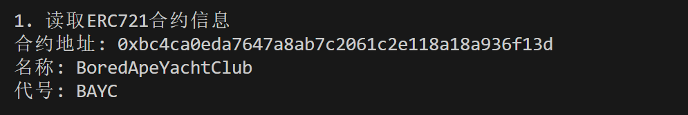
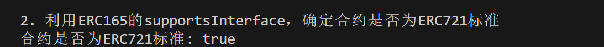

这一讲，我们介绍如何用 `ether.js` 识别一个合约是否为 `ERC721` 标准。

## **ERC721**

`ERC721` 是以太坊上流行的非同质化代币（NFT）标准。在做 NFT 相关产品时，我们需要筛选出符合 `ERC721` 标准的合约。例如 Opensea，他会自动识别 `ERC721`，并爬下它的名称、代号、metadata 等数据用于展示。要识别 `ERC721`，我们先要理解 `ERC165`。

## **ERC165**

通过<u>ERC165 标准</u>，智能合约可以声明它支持的接口，供其他合约检查。因此，我们可以通过 `ERC165` 来检查一个智能合约是不是支持了 `ERC721` 的接口。

`IERC165` 接口合约只声明了一个 `supportsInterface` 函数，输入要查询的 `interfaceId` 接口 id（类型为 `bytes4`），若合约实现了该接口 id，则返回 `true`；反之，则返回 `false`：

```javascript
interface IERC165 {
    /**
     * @dev 如果合约实现了查询的`interfaceId`，则返回true
     * 规则详见：https://eips.ethereum.org/EIPS/eip-165#how-interfaces-are-identified[EIP section]
     *
     */
    function supportsInterface(bytes4 interfaceId) external view returns (bool);
}
```

`ERC721` 合约中会实现 `IERC165` 接口合约的 `supportsInterface` 函数，并且当查询 `0x80ac58cd`（`ERC721` 接口 id）时返回 `true`。

```javascript
function supportsInterface(bytes4 interfaceId)
        external
        pure
        override
        returns (bool)
    {
        return
            interfaceId == type(IERC721).interfaceId 
    }
```

## **识别ERC721**

1. 创建 `provider`，连接以太坊主网。

```javascript
//准备 alchemy API 可以参考https://github.com/AmazingAng/WTFSolidity/blob/main/Topics/Tools/TOOL04_Alchemy/readme.md 
const ALCHEMY_MAINNET_URL = 'https://eth-mainnet.g.alchemy.com/v2/oKmOQKbneVkxgHZfibs-iFhIlIAl6HDN';
const provider = new ethers.JsonRpcProvider(ALCHEMY_MAINNET_URL);
```

2. 创建 `ERC721` 合约实例，在 `abi` 接口中，我们声明要使用的 `name()`，`symbol()`，和 `supportsInterface()` 函数即可。这里我们用的 BAYC 的合约地址。
 ```javascript
// 合约 abi
const abiERC721 = [
"function name() view returns (string)",
"function symbol() view returns (string)",
"function supportsInterface(bytes4) public view returns(bool)",
];
// ERC721 的合约地址，这里用的 BAYC
const addressBAYC = "0xbc4ca0eda7647a8ab7c2061c2e118a18a936f13d"
// 创建 ERC721 合约实例
const contractERC721 = new ethers.Contract(addressBAYC, abiERC721, provider)

```

3. 读取合约的链上信息：名称和代号。

```javascript
// 1. 读取ERC721合约的链上信息
const nameERC721 = await contractERC721.name()
const symbolERC721 = await contractERC721.symbol()
console.log("\n1. 读取ERC721合约信息")
console.log(`合约地址: ${addressBAYC}`)
console.log(`名称: ${nameERC721}`)
console.log(`代号: ${symbolERC721}`)
```



4. 利用 `ERC165` 的 `supportsInterface()` 函数，识别合约是否为 ERC721 标准。如果是，则返回 `true`；反之，则报错或返回 `false`。

注意此处的代码中的 `selectorERC721` 常量被提取出 main 函数

```javascript
// 2. 利用ERC165的supportsInterface，确定合约是否为ERC721标准
// ERC721接口的ERC165 identifier
const selectorERC721 = "0x80ac58cd"
const isERC721 = await contractERC721.supportsInterface(selectorERC721)
console.log("\n2. 利用ERC165的supportsInterface，确定合约是否为ERC721标准")
console.log(`合约是否为ERC721标准: ${isERC721}`)
```



完整代码

```javascript
const ethers = require('ethers');

//准备 alchemy API
const ALCHEMY_MAINNET_URL = 'https://eth-mainnet.g.alchemy.com/v2/';
const provider = new ethers.JsonRpcProvider(ALCHEMY_MAINNET_URL);

// 合约abi
const abiERC721 = [
    "function name() view returns (string)",
    "function symbol() view returns (string)",
    "function supportsInterface(bytes4) public view returns(bool)",
];
// ERC721的合约地址，这里用的BAYC
const addressBAYC = "0xbc4ca0eda7647a8ab7c2061c2e118a18a936f13d"
// 创建ERC721合约实例
const contractERC721 = new ethers.Contract(addressBAYC, abiERC721, provider)

// ERC721接口的ERC165 identifier
const selectorERC721 = "0x80ac58cd"

const main = async () => {
    try {
    // 1. 读取ERC721合约的链上信息
    const nameERC721 = await contractERC721.name()
    const symbolERC721 = await contractERC721.symbol()
    console.log("\n1. 读取ERC721合约信息")
    console.log(`合约地址: ${addressBAYC}`)
    console.log(`名称: ${nameERC721}`)
    console.log(`代号: ${symbolERC721}`)

    // 2. 利用ERC165的supportsInterface，确定合约是否为ERC721标准
    const isERC721 = await contractERC721.supportsInterface(selectorERC721)
    console.log("\n2. 利用ERC165的supportsInterface，确定合约是否为ERC721标准")
    console.log(`合约是否为ERC721标准: ${isERC721}`)
    }catch (e) {
        // 如果不是ERC721，则会报错
        console.log(e);
    }
}

main()
```

## **总结**

这一讲，我们介绍如何 `ethers.js` 来识别一个合约是否为 `ERC721`。由于利用了 `ERC165` 标准，因此只有支持 `ERC165` 标准的合约才能用这个方法识别，包括 `ERC721`，`ERC1155` 等。但是像 `ERC20` 这种不支持 `ERC165` 的标准，就要用别的方法识别了。你知道怎么检查一个合约是否为 `ERC20` 吗？
