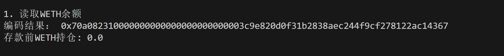

这一讲，我们将介绍 `ethers.js` 中的接口类，并利用它编码 `calldata`。

## **接口类 Interface**

`ethers.js` 的接口类抽象了与以太坊网络上的合约交互所需的 `ABI` 编码和解码。`ABI`（Application Binary Interface）与 `API` 类似，是一格式，用于对合约可以处理的各种类型的数据进行编码，以便它们可以交互。

我们可以利用 `abi` 生成或者直接从合约中获取 `interface` 变量：

```javascript
// 利用abi生成
const interface = ethers.Interface(abi)
// 直接从contract中获取
const interface2 = contract.interface
```

接口类封装了一些编码解码的方法。与一些特殊的合约交互时（比如代理合约），你需要编码参数、解码返回值：

**注意**：相关函数必须包含在 `abi` 中。

- `getSighash()`：获取函数选择器（function selector），参数为函数名或函数签名。

```javascript
interface.getSighash("balanceOf");
// '0xddf252ad1be2c89b69c2b068fc378daa952ba7f163c4a11628f55a4df523b3ef'
```

- `encodeDeploy()`：编码构造器的参数，然后可以附在合约字节码的后面。

```javascript
interface.encodeDeploy("Wrapped ETH", "WETH");
```

- `encodeFunctionData()`：编码函数的 `calldata`。

```javascript
interface.encodeFunctionData("balanceOf", ["0xc778417e063141139fce010982780140aa0cd5ab"]);
```

- `decodeFunctionResult()`：解码函数的返回值。

```javascript
interface.decodeFunctionResult("balanceOf", resultData)
```

## **例子：与测试网****WETH****合约交互**

这里，我们利用接口类编码 `calldata` 的方法，重复第 5 讲中与测试网 `WETH` 合约交互的例子。

1. 创建 `provider`，`wallet` 变量。

```javascript
const ethers = require('ethers');

//准备 alchemy API 
const ALCHEMY_SEPOLIA_URL = 'https://eth-sepolia.g.alchemy.com/v2/...';
const provider = new ethers.JsonRpcProvider(ALCHEMY_SEPOLIA_URL);

// 利用私钥和provider创建wallet对象
const privateKey = '0f03a73988c990c2333bbbcd99d442377fedbe48083a8a9c4426ace223c33e5d'
const wallet = new ethers.Wallet(privateKey, provider)
```

2. 创建 `WETH` 合约实例

```javascript
// WETH的ABI
const abiWETH = [
    "function balanceOf(address) public view returns(uint)",
    "function deposit() public payable",
];
// WETH合约地址（sepolia测试网）
const addressWETH = '0x7b79995e5f793a07bc00c21412e50ecae098e7f9'
// 声明WETH合约
const contractWETH = new ethers.Contract(addressWETH, abiWETH, wallet)
```

3. 调用 `balanceOf()` 函数，读取钱包地址 `address` 的 `WETH` 余额。

```javascript
const address = await wallet.getAddress()
// 1. 读取WETH合约的链上信息（WETH abi）
console.log("\n1. 读取WETH余额")
// 编码calldata
const param1 = contractWETH.interface.encodeFunctionData(
    "balanceOf",
    [address]
  );
console.log(`编码结果： ${param1}`)
// 创建交易
const tx1 = {
    to: addressWETH,
    data: param1
}
// 发起交易，可读操作（view/pure）可以用 provider.call(tx)
const balanceWETH = await provider.call(tx1)
console.log(`存款前WETH持仓: ${ethers.formatEther(balanceWETH)}\n`)
```



4. 调用 `deposit()` 函数，将 `0.001 ETH` 转换为 `0.001 WETH`，打印交易详情和余额。可以看到余额变化。

```javascript
// 编码calldata
const param2 = contractWETH.interface.encodeFunctionData(
    "deposit"          
    );
console.log(`编码结果： ${param2}`)
// 创建交易
const tx2 = {
    to: addressWETH,
    data: param2,
    value: ethers.parseEther("0.001")}
// 发起交易，写入操作需要 wallet.sendTransaction(tx)
const receipt1 = await wallet.sendTransaction(tx2)
// 等待交易上链
await receipt1.wait()
console.log(`交易详情：`)
console.log(receipt1)
const balanceWETH_deposit = await contractWETH.balanceOf(address)
console.log(`存款后WETH持仓: ${ethers.formatEther(balanceWETH_deposit)}\n`)
```


## **总结**

这一讲，我们介绍了 `ethers.js` 中的接口类，并利用它编码 `calldata` 与 `WETH` 合约交互。与一些特殊的合约交互时（比如代理合约），你需要用这类方法编码参数，然后解码返回值。
