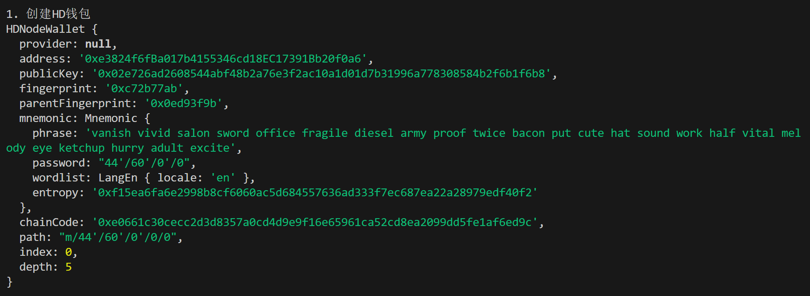
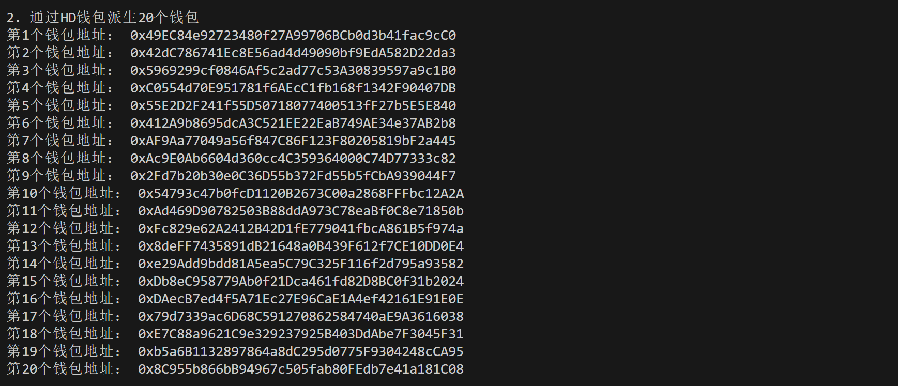
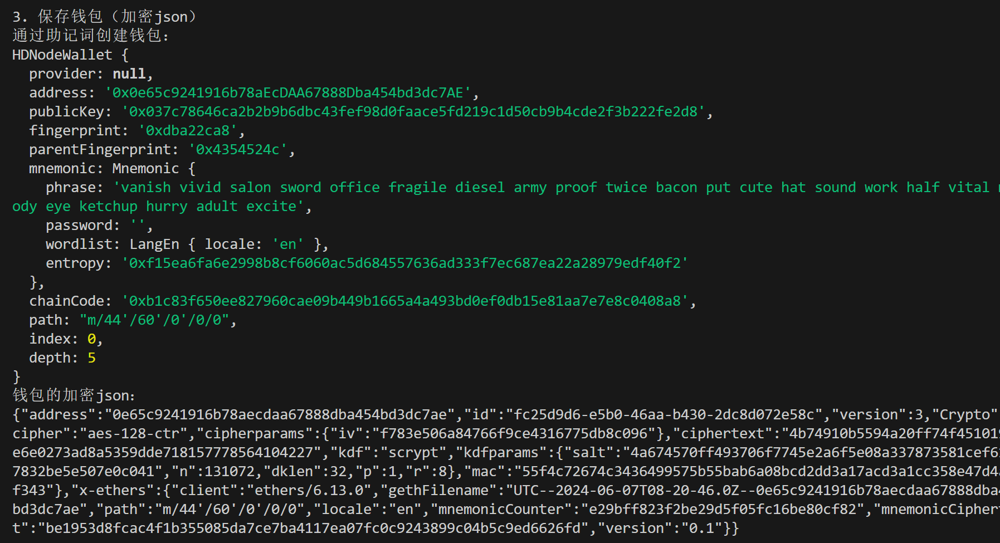
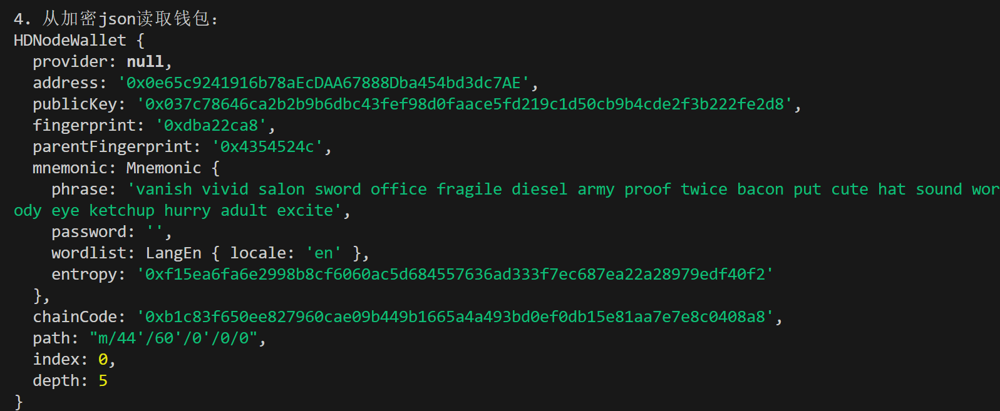

这一讲，我们将介绍 HD 钱包，并写一个批量生成钱包的脚本。

## **HD 钱包**

HD 钱包（Hierarchical Deterministic Wallet，多层确定性钱包）是一种数字钱包 ，通常用于存储比特币和以太坊等加密货币持有者的数字密钥。通过它，用户可以从一个随机种子创建一系列密钥对，更加便利、安全、隐私。要理解 HD 钱包，我们需要简单了解比特币的<u>BIP32</u>，<u>BIP44</u>，和<u>BIP39</u>。

### **BIP32**

在 `BIP32` 推出之前，用户需要记录一堆的私钥才能管理很多钱包。`BIP32` 提出可以用一个随机种子衍生多个私钥，更方便的管理多个钱包。钱包的地址由衍生路径决定，例如 `“m/0/0/1”`。


### **BIP44**

`BIP44` 为 `BIP32` 的衍生路径提供了一套通用规范，适配比特币、以太坊等多链。这一套规范包含六级，每级之间用"/"分割：

```
m / purpose' / coin_type' / account' / change / address_index
```

其中：

- m: 固定为"m"
- purpose：固定为"44"
- coin_type：代币类型，比特币主网为 0，比特币测试网为 1，以太坊主网为 60
- account：账户索引，从 0 开始。
- change：是否为外部链，0 为外部链，1 为内部链，一般填 0.
- address_index：地址索引，从 0 开始，想生成新地址就把这里改为 1，2，3。

举个例子，以太坊的默认衍生路径为 `"m/44'/60'/0'/0/0"`。

### **BIP39**

`BIP39` 让用户能以一些人类可记忆的助记词的方式保管私钥，而不是一串 16 进制的数字：

```
//私钥
0x813f8f0a4df26f6455814fdd07dd2ab2d0e2d13f4d2f3c66e7fd9e3856060f89
//助记词
air organ twist rule prison symptom jazz cheap rather dizzy verb glare jeans orbit weapon universe require tired sing casino business anxiety seminar hunt
```

## **批量生成钱包**

`ethers.js` 提供了<u>HDNodeWallet 类</u>，方便开发者使用 HD 钱包。下面我们利用它从一个助记词批量生成 20 个钱包。

1. 创建 `baseWallet` 钱包变量，可以看到助记词为 `'air organ twist rule prison symptom jazz cheap rather dizzy verb glare jeans orbit weapon universe require tired sing casino business anxiety seminar hunt'`

```javascript
// 生成随机助记词
const mnemonic = ethers.Mnemonic.entropyToPhrase(ethers.randomBytes(32))
// 创建HD基钱包
// 基路径："m / purpose' / coin_type' / account' / change"
const basePath = "44'/60'/0'/0"
const baseWallet = ethers.HDNodeWallet.fromPhrase(mnemonic, basePath)
console.log(baseWallet);
```



2. 通过 HD 钱包派生 20 个钱包。

```javascript
const numWallet = 20
// 派生路径：基路径 + "/ address_index"
// 我们只需要提供最后一位address_index的字符串格式，就可以从baseWallet派生出新钱包。V6中不需要重复提供基路径！
let wallets = [];
for (let i = 0; i < numWallet; i++) {
    let baseWalletNew = baseWallet.derivePath(i.toString());
    console.log(`第${i+1}个钱包地址： ${baseWalletNew.address}`)
    wallets.push(baseWalletNew);
}
```



3. 保存钱包为加密 json：

```javascript
const wallet = ethers.Wallet.fromPhrase(mnemonic)
console.log("通过助记词创建钱包：")
console.log(wallet)
// 加密json用的密码，可以更改成别的
const pwd = "RCC"
const json = await wallet.encrypt(pwd)
console.log("钱包的加密json：")
console.log(json)
```



4. 从加密 json 中读取钱包：

```javascript
const wallet2 = await ethers.Wallet.fromEncryptedJson(json, pwd);
console.log("\n4. 从加密json读取钱包：")
console.log(wallet2)
```



完整代码

```javascript
const ethers = require('ethers');

async function main() {
    // 1. 创建HD钱包 (ethers V6)
    console.log("\n1. 创建HD钱包");
    // 生成随机助记词
    const mnemonic = ethers.Mnemonic.entropyToPhrase(ethers.randomBytes(32));
    // 创建HD基钱包
    const basePath = "44'/60'/0'/0";
    const baseWallet = ethers.HDNodeWallet.fromPhrase(mnemonic, basePath);
    console.log(baseWallet);

    // 2. 通过HD钱包派生20个钱包
    console.log("\n2. 通过HD钱包派生20个钱包");
    const numWallet = 20;
    let wallets = [];
    for (let i = 0; i < numWallet; i++) {
        let baseWalletNew = baseWallet.derivePath(i.toString());
        console.log(`第${i + 1}个钱包地址： ${baseWalletNew.address}`);
        wallets.push(baseWalletNew);
    }

    // 3. 保存钱包（加密json）
    console.log("\n3. 保存钱包（加密json）");
    const wallet = ethers.Wallet.fromPhrase(mnemonic);
    console.log("通过助记词创建钱包：");
    console.log(wallet);
    const pwd = "RCC";  // 加密json用的密码，可以更改成别的
    const json = await wallet.encrypt(pwd);
    console.log("钱包的加密json：");
    console.log(json);

    // 4. 从加密json读取钱包
    const wallet2 = await ethers.Wallet.fromEncryptedJson(json, pwd);
    console.log("\n4. 从加密json读取钱包：");
    console.log(wallet2);
}

main().catch(console.error);
```

## **总结**

这一讲我们介绍了 HD 钱包（BIP32，BIP44，BIP39），并利用它使用 `ethers.js` 批量生成了 20 个钱包。
