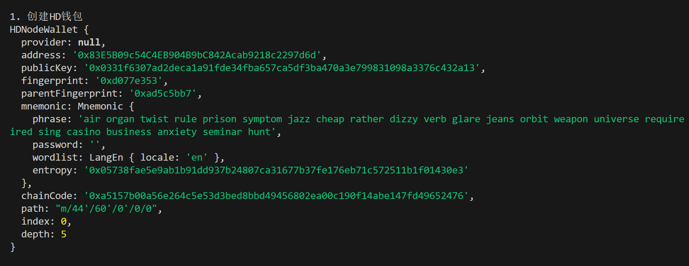
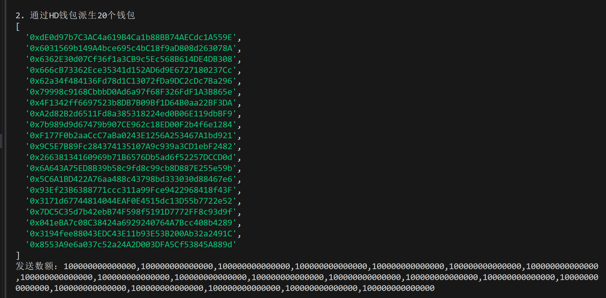
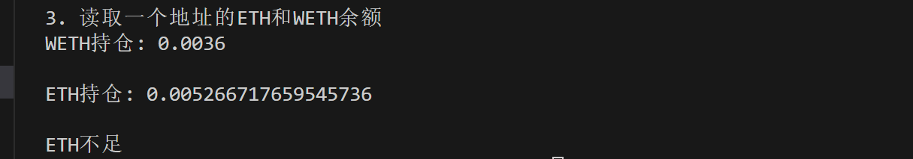

这一讲，我们将介绍用 `ethers.js` 进行批量转账。通过调用 `Airdrop` 合约，可以在一笔交易中实现批量转账，节省 gas 费。

## **Airdrop 合约**

```javascript
// SPDX-License-Identifier: MIT
pragma solidity ^0.8.21;

import "./IERC20.sol"; //import IERC20

/// @notice 向多个地址转账ERC20代币
contract Airdrop {
    mapping(address => uint) failTransferList;

    /// @notice 向多个地址转账ERC20代币，使用前需要先授权
    ///
    /// @param _token 转账的ERC20代币地址
    /// @param _addresses 空投地址数组
    /// @param _amounts 代币数量数组（每个地址的空投数量）
    function multiTransferToken(
        address _token,
        address[] calldata _addresses,
        uint256[] calldata _amounts
    ) external {
        // 检查：_addresses和_amounts数组的长度相等
        require(
            _addresses.length == _amounts.length,
            "Lengths of Addresses and Amounts NOT EQUAL"
        );
        IERC20 token = IERC20(_token); // 声明IERC合约变量
        uint _amountSum = getSum(_amounts); // 计算空投代币总量
        // 检查：授权代币数量 > 空投代币总量
        require(
            token.allowance(msg.sender, address(this)) > _amountSum,
            "Need Approve ERC20 token"
        );

        // for循环，利用transferFrom函数发送空投
        for (uint256 i; i < _addresses.length; i++) {
            token.transferFrom(msg.sender, _addresses[i], _amounts[i]);
        }
    }

    /// 向多个地址转账ETH
    function multiTransferETH(
        address payable[] calldata _addresses,
        uint256[] calldata _amounts
    ) public payable {
        // 检查：_addresses和_amounts数组的长度相等
        require(
            _addresses.length == _amounts.length,
            "Lengths of Addresses and Amounts NOT EQUAL"
        );
        uint _amountSum = getSum(_amounts); // 计算空投ETH总量
        // 检查转入ETH等于空投总量
        require(msg.value == _amountSum, "Transfer amount error");
        // for循环，利用transfer函数发送ETH
        for (uint256 i = 0; i < _addresses.length; i++) {
            // 注释代码有Dos攻击风险, 并且transfer 也是不推荐写法
            (bool success, ) = _addresses[i].call{value: _amounts[i]}("");
            if (!success) {
                failTransferList[_addresses[i]] = _amounts[i];
            }
        }
    }

    // 给空投失败提供主动操作机会
    function withdrawFromFailList(address _to) public {
        uint failAmount = failTransferList[msg.sender];
        require(failAmount > 0, "You are not in failed list");
        failTransferList[msg.sender] = 0;
        (bool success, ) = _to.call{value: failAmount}("");
        require(success, "Fail withdraw");
    }

    // 数组求和函数
    function getSum(uint256[] calldata _arr) public pure returns (uint sum) {
        for (uint i = 0; i < _arr.length; i++) sum = sum + _arr[i];
    }
}

// ERC20代币合约
contract ERC20 is IERC20 {
    mapping(address => uint256) public override balanceOf;

    mapping(address => mapping(address => uint256)) public override allowance;

    uint256 public override totalSupply; // 代币总供给

    string public name; // 名称
    string public symbol; // 符号

    uint8 public decimals = 18; // 小数位数

    constructor(string memory name_, string memory symbol_) {
        name = name_;
        symbol = symbol_;
    }

    // @dev 实现`transfer`函数，代币转账逻辑
    function transfer(
        address recipient,
        uint amount
    ) public override returns (bool) {
        balanceOf[msg.sender] -= amount;
        balanceOf[recipient] += amount;
        emit Transfer(msg.sender, recipient, amount);
        return true;
    }

    // @dev 实现 `approve` 函数, 代币授权逻辑
    function approve(
        address spender,
        uint amount
    ) public override returns (bool) {
        allowance[msg.sender][spender] = amount;
        emit Approval(msg.sender, spender, amount);
        return true;
    }

    // @dev 实现`transferFrom`函数，代币授权转账逻辑
    function transferFrom(
        address sender,
        address recipient,
        uint amount
    ) public override returns (bool) {
        allowance[sender][msg.sender] -= amount;
        balanceOf[sender] -= amount;
        balanceOf[recipient] += amount;
        emit Transfer(sender, recipient, amount);
        return true;
    }

    // @dev 铸造代币，从 `0` 地址转账给 调用者地址
    function mint(uint amount) external {
        balanceOf[msg.sender] += amount;
        totalSupply += amount;
        emit Transfer(address(0), msg.sender, amount);
    }

    // @dev 销毁代币，从 调用者地址 转账给  `0` 地址
    function burn(uint amount) external {
        balanceOf[msg.sender] -= amount;
        totalSupply -= amount;
        emit Transfer(msg.sender, address(0), amount);
    }
}
```

```javascript
//IERC20.sol
// SPDX-License-Identifier: MIT
pragma solidity ^0.8.21;

/**
 * @dev ERC20 接口合约.
 */
interface IERC20 {
    /**
     * @dev 释放条件：当 `value` 单位的货币从账户 (`from`) 转账到另一账户 (`to`)时.
     */
    event Transfer(address indexed from, address indexed to, uint256 value);

    /**
     * @dev 释放条件：当 `value` 单位的货币从账户 (`owner`) 授权给另一账户 (`spender`)时.
     */
    event Approval(address indexed owner, address indexed spender, uint256 value);

    /**
     * @dev 返回代币总供给.
     */
    function totalSupply() external view returns (uint256);

    /**
     * @dev 返回账户`account`所持有的代币数.
     */
    function balanceOf(address account) external view returns (uint256);

    /**
     * @dev 转账 `amount` 单位代币，从调用者账户到另一账户 `to`.
     *
     * 如果成功，返回 `true`.
     *
     * 释放 {Transfer} 事件.
     */
    function transfer(address to, uint256 amount) external returns (bool);

    /**
     * @dev 返回`owner`账户授权给`spender`账户的额度，默认为0。
     *
     * 当{approve} 或 {transferFrom} 被调用时，`allowance`会改变.
     */
    function allowance(address owner, address spender) external view returns (uint256);

    /**
     * @dev 调用者账户给`spender`账户授权 `amount`数量代币。
     *
     * 如果成功，返回 `true`.
     *
     * 释放 {Approval} 事件.
     */
    function approve(address spender, uint256 amount) external returns (bool);

    /**
     * @dev 通过授权机制，从`from`账户向`to`账户转账`amount`数量代币。转账的部分会从调用者的`allowance`中扣除。
     *
     * 如果成功，返回 `true`.
     *
     * 释放 {Transfer} 事件.
     */
    function transferFrom(
        address from,
        address to,
        uint256 amount
    ) external returns (bool);
}
```

这里简单介绍下 `Airdrop` 合约。我们会用到 `2` 个函数：

- `multiTransferETH()`：批量发送 `ETH`，包含 `2` 个参数：

  - `_addresses`：接收空投的用户地址数组（`address[]` 类型）
  - `_amounts`：空投数量数组，对应 `_addresses` 里每个地址的数量（`uint[]` 类型）
- `multiTransferToken()` 函数：批量发送 `ERC20` 代币，包含 `3` 个参数：

  - `_token`：代币合约地址（`address` 类型）
  - `_addresses`：接收空投的用户地址数组（`address[]` 类型）
  - `_amounts`：空投数量数组，对应 `_addresses` 里每个地址的数量（`uint[]` 类型）

## **批量转账**

下面我们写一个脚本，调用 `Airdrop` 合约将 `ETH`（原生代币）和 `WETH`（ERC20 代币）转账给 `20` 个地址。

1. 创建 HD 钱包，用于批量生成地址。

```javascript
console.log("\n1. 创建HD钱包")
// 通过助记词生成HD钱包
const mnemonic = `air organ twist rule prison symptom jazz cheap rather dizzy verb glare jeans orbit weapon universe require tired sing casino business anxiety seminar hunt`
const hdNode = ethers.HDNodeWallet.fromPhrase(mnemonic)
console.log(hdNode);
```



2. 利用 HD 钱包，生成 20 个钱包地址。

```javascript
console.log("\n2. 通过HD钱包派生20个钱包")
const numWallet = 20
// 派生路径：m / purpose' / coin_type' / account' / change / address_index
// 我们只需要切换最后一位address_index，就可以从hdNode派生出新钱包
let basePath = "44'/60'/0'/0";
let addresses = [];
for (let i = 0; i < numWallet; i++) {
    let hdNodeNew = hdNode.derivePath(basePath + "/" + i);
    let walletNew = new ethers.Wallet(hdNodeNew.privateKey);
    addresses.push(walletNew.address);
}
console.log(addresses)
const amounts = Array(20).fill(ethers.parseEther("0.0001"))
console.log(`发送数额：${amounts}`)
```



3. 创建 provider 和 wallet，发送代币用。

```javascript
// 利用Alchemy的rpc节点连接以太坊测试网络
const ALCHEMY_SEPOLIA_URL = 'https://eth-sepolia.g.alchemy.com/v2/....';
const provider = new ethers.JsonRpcProvider(ALCHEMY_SEPOLIA_URL);

// 利用私钥和provider创建wallet对象
const privateKey = '0f03a73988c990c2333bbbcd99d442377fedbe48083a8a9c4426ace223c33e5d'
const wallet = new ethers.Wallet(privateKey, provider)
```

4. 创建 Airdrop 合约。

```javascript
// 4. 声明Airdrop合约
// Airdrop的ABI
const abiAirdrop = [
    "function multiTransferToken(address,address[],uint256[]) external",
    "function multiTransferETH(address[],uint256[]) public payable",
];
// Airdrop合约地址（sepolia测试网）
const addressAirdrop = '0x271cf0ef2d4da48f751912244f794bbcc9878a1b' // Airdrop Contract
// 声明Airdrop合约
const contractAirdrop = new ethers.Contract(addressAirdrop, abiAirdrop, wallet)
```

5. 创建 WETH 合约。

```javascript
// 5. 声明WETH合约
// WETH的ABI
const abiWETH = [
    "function balanceOf(address) public view returns(uint)",
    "function transfer(address, uint) public returns (bool)",
    "function approve(address, uint256) public returns (bool)"
];
// WETH合约地址（sepolia测试网）
const addressWETH = '0x7b79995e5f793a07bc00c21412e50ecae098e7f9' // WETH Contract
// 声明WETH合约
const contractWETH = new ethers.Contract(addressWETH, abiWETH, wallet)
```

6. 读取一个地址的 ETH 和 WETH 余额。

```javascript
console.log("\n3. 读取一个地址的ETH和WETH余额")
//读取WETH余额
const balanceWETH = await contractWETH.balanceOf(addresses[10])
console.log(`WETH持仓: ${ethers.formatEther(balanceWETH)}\n`)
//读取ETH余额
const balanceETH = await provider.getBalance(addresses[10])
console.log(`ETH持仓: ${ethers.formatEther(balanceETH)}\n`)
```



7. 调用 `multiTransferETH()` 函数，给每个钱包转 `0.0001 ETH`，可以看到发送后余额发生变化。

```javascript
console.log("\n4. 调用multiTransferETH()函数，给每个钱包转 0.0001 ETH")
// 发起交易
const tx = await contractAirdrop.multiTransferETH(addresses, amounts, {value: ethers.parseEther("0.002")})
// 等待交易上链
await tx.wait()
// console.log(`交易详情：`)
// console.log(tx)
const balanceETH2 = await provider.getBalance(addresses[10])
console.log(`发送后该钱包ETH持仓: ${ethers.formatEther(balanceETH2)}\n`)
```

8. 调用 multiTransferToken()函数，给每个钱包转 `0.0001 WETH`，可以看到发送后余额发生变化。

```javascript
console.log("\n5. 调用multiTransferToken()函数，给每个钱包转 0.0001 WETH")
// 先approve WETH给Airdrop合约
const txApprove = await contractWETH.approve(addressAirdrop, ethers.parseEther("1"))
await txApprove.wait()
// 发起交易
const tx2 = await contractAirdrop.multiTransferToken(addressWETH, addresses, amounts)
// 等待交易上链
await tx2.wait()
// console.log(`交易详情：`)
// console.log(tx2)
// 读取WETH余额
const balanceWETH2 = await contractWETH.balanceOf(addresses[10])
console.log(`发送后该钱包WETH持仓: ${ethers.formatEther(balanceWETH2)}\n`)
```

完整代码

```javascript
const ethers = require('ethers');

// 1. 创建HD钱包
console.log("\n1. 创建HD钱包")
// 通过助记词生成HD钱包
const mnemonic = `air organ twist rule prison symptom jazz cheap rather dizzy verb glare jeans orbit weapon universe require tired sing casino business anxiety seminar hunt`
const hdNode = ethers.HDNodeWallet.fromPhrase(mnemonic)
console.log(hdNode);

// 2. 获得20个钱包的地址
console.log("\n2. 通过HD钱包派生20个钱包")
const numWallet = 20
// 派生路径：m / purpose' / coin_type' / account' / change / address_index
// 我们只需要切换最后一位address_index，就可以从hdNode派生出新钱包
let basePath = "44'/60'/0'/0";
let addresses = [];
for (let i = 0; i < numWallet; i++) {
    let hdNodeNew = hdNode.derivePath(basePath + "/" + i);
    let walletNew = new ethers.Wallet(hdNodeNew.privateKey);
    addresses.push(walletNew.address);
}
console.log(addresses)
const amounts = Array(20).fill(ethers.parseEther("0.0001"))
console.log(`发送数额：${amounts}`)

// 利用Alchemy的rpc节点连接以太坊测试网络
const ALCHEMY_SEPOLIA_URL = 'https://eth-sepolia.g.alchemy.com/v2/...';
const provider = new ethers.JsonRpcProvider(ALCHEMY_SEPOLIA_URL);

// 利用私钥和provider创建wallet对象
const privateKey = '0f03a73988c990c2333bbbcd99d442377fedbe48083a8a9c4426ace223c33e5d'
const wallet = new ethers.Wallet(privateKey, provider)

// 4. 声明Airdrop合约
// Airdrop的ABI
const abiAirdrop = [
    "function multiTransferToken(address,address[],uint256[]) external",
    "function multiTransferETH(address[],uint256[]) public payable",
];
// Airdrop合约地址（sepolia测试网）
const addressAirdrop = '0x271cf0ef2d4da48f751912244f794bbcc9878a1b' // Airdrop Contract
// 声明Airdrop合约
const contractAirdrop = new ethers.Contract(addressAirdrop, abiAirdrop, wallet)

// 5. 声明WETH合约
// WETH的ABI
const abiWETH = [
    "function balanceOf(address) public view returns(uint)",
    "function transfer(address, uint) public returns (bool)",
    "function approve(address, uint256) public returns (bool)"
];
// WETH合约地址（sepolia测试网）
const addressWETH = '0x7b79995e5f793a07bc00c21412e50ecae098e7f9' // WETH Contract
// 声明WETH合约
const contractWETH = new ethers.Contract(addressWETH, abiWETH, wallet)

const main = async () => {

    // 6. 读取一个地址的ETH和WETH余额
    console.log("\n3. 读取一个地址的ETH和WETH余额")
    //读取WETH余额
    const balanceWETH = await contractWETH.balanceOf(addresses[10])
    console.log(`WETH持仓: ${ethers.formatEther(balanceWETH)}\n`)
    //读取ETH余额
    const balanceETH = await provider.getBalance(addresses[10])
    console.log(`ETH持仓: ${ethers.formatEther(balanceETH)}\n`)

    const myETH = await provider.getBalance(wallet)
    const myToken = await contractWETH.balanceOf(wallet.getAddress())
    // 如果钱包ETH足够和WETH足够
    if(ethers.formatEther(myETH) > 0.002 && ethers.formatEther(myToken) >= 0.002){

        // 7. 调用multiTransferETH()函数，给每个钱包转 0.0001 ETH
        console.log("\n4. 调用multiTransferETH()函数，给每个钱包转 0.0001 ETH")
        // 发起交易
        const tx = await contractAirdrop.multiTransferETH(addresses, amounts, {value: ethers.parseEther("0.002")})
        // 等待交易上链
        await tx.wait()
        // console.log(`交易详情：`)
        // console.log(tx)
        const balanceETH2 = await provider.getBalance(addresses[10])
        console.log(`发送后该钱包ETH持仓: ${ethers.formatEther(balanceETH2)}\n`)
        
        // 8. 调用multiTransferToken()函数，给每个钱包转 0.0001 WETH
        console.log("\n5. 调用multiTransferToken()函数，给每个钱包转 0.0001 WETH")
        // 先approve WETH给Airdrop合约
        const txApprove = await contractWETH.approve(addressAirdrop, ethers.parseEther("1"))
        await txApprove.wait()
        // 发起交易
        const tx2 = await contractAirdrop.multiTransferToken(addressWETH, addresses, amounts)
        // 等待交易上链
        await tx2.wait()
        // console.log(`交易详情：`)
        // console.log(tx2)
        // 读取WETH余额
        const balanceWETH2 = await contractWETH.balanceOf(addresses[10])
        console.log(`发送后该钱包WETH持仓: ${ethers.formatEther(balanceWETH2)}\n`)

    }else{
        // 如果ETH和WETH不足
        console.log("ETH不足")
    }
}

main()
```

## **总结**

这一讲，我们介绍了如何利用 `ethers.js` 调用 `Airdrop` 合约进行批量转账。在例子中，我们将 `ETH` 和 `WETH` 发送给了 `20` 个不同地址，省事且省钱（gas 费）。
