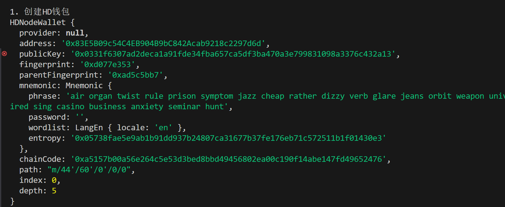
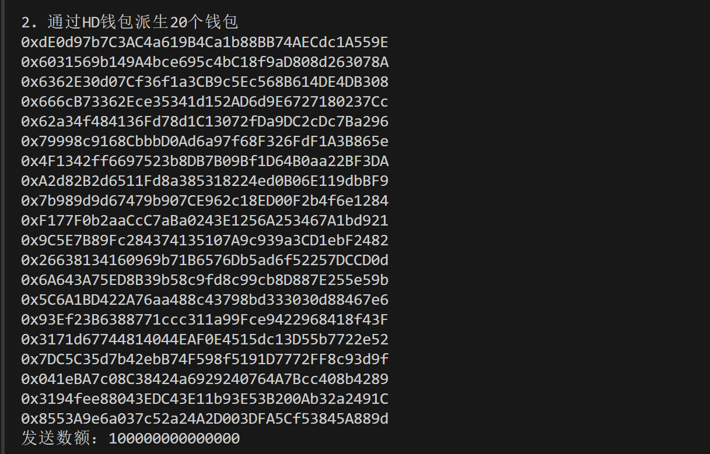
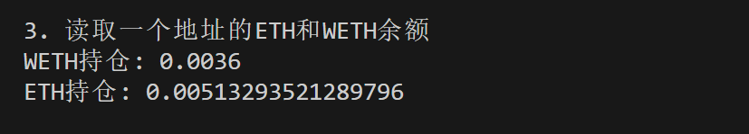
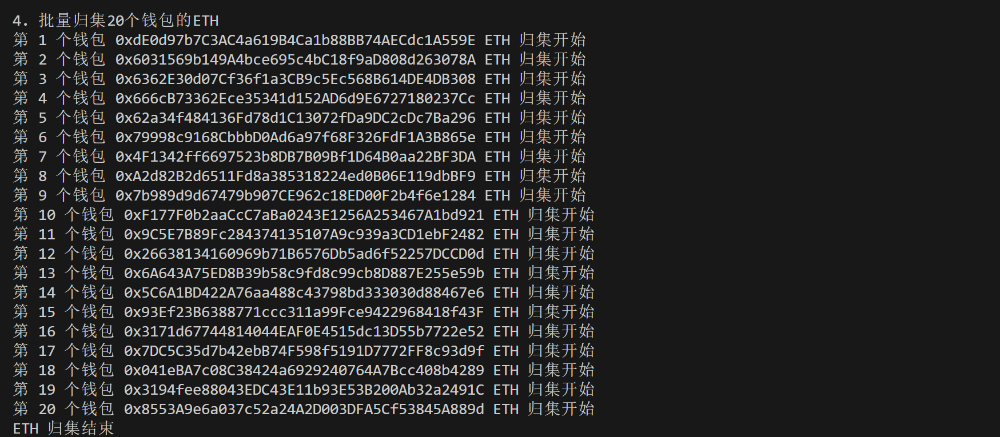
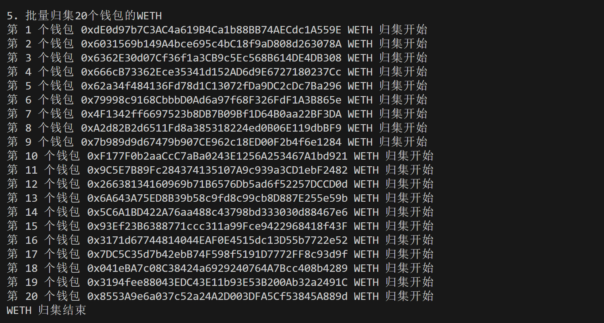
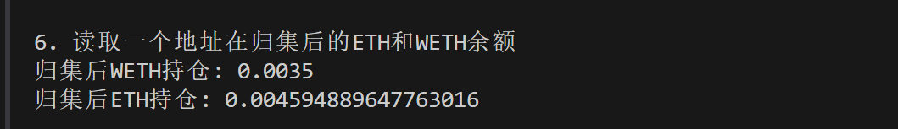

这一讲，我们介绍如何使用 `ethers.js` 将多个钱包的 `ETH` 和代币归集到一个钱包中。

## **批量归集**

在链上交互、撸毛之后，就需要将多个钱包的资产进行归集管理。你可以用 HD 钱包或者保存多份密钥的方式操作多个钱包，然后用 `ethers.js` 脚本完成归集。下面我们分别示范归集 `ETH`（原生代币）和 `WETH`（ERC20 代币）。

1. 创建 `provider` 和 `wallet`，其中 `wallet` 是接收资产的钱包。

```javascript
// 利用Alchemy的rpc节点连接以太坊测试网络
const ALCHEMY_SEPOLIA_URL = 'https://eth-sepolia.g.alchemy.com/v2/...';
const provider = new ethers.JsonRpcProvider(ALCHEMY_SEPOLIA_URL);
// 利用私钥和provider创建wallet对象
const privateKey = '0f03a73988c990c2333bbbcd99d442377fedbe48083a8a9c4426ace223c33e5d'
const wallet = new ethers.Wallet(privateKey, provider)
```

2. 声明 WETH 合约。

```javascript
// WETH的ABI
const abiWETH = [
    "function balanceOf(address) public view returns(uint)",
    "function transfer(address, uint) public returns (bool)",
];
// WETH合约地址（sepolia测试网）
const addressWETH = '0x7b79995e5f793a07bc00c21412e50ecae098e7f9' // WETH Contract
// 声明WETH合约
const contractWETH = new ethers.Contract(addressWETH, abiWETH, wallet)
```

3. 创建 `HD` 钱包，用于管理多个钱包。

```javascript
console.log("\n1. 创建HD钱包")
// 通过助记词生成HD钱包
const mnemonic = `air organ twist rule prison symptom jazz cheap rather dizzy verb glare jeans orbit weapon universe require tired sing casino business anxiety seminar hunt`
const hdNode = ethers.HDNodeWallet.fromPhrase(mnemonic)
console.log(hdNode);
```



4. 通过 `HD` 钱包衍生 `20` 个钱包，这些钱包上需要有资产。

```javascript
const numWallet = 20
// 派生路径：m / purpose' / coin_type' / account' / change / address_index
// 我们只需要切换最后一位address_index，就可以从hdNode派生出新钱包
let basePath = "m/44'/60'/0'/0";
let wallets = [];
for (let i = 0; i < numWallet; i++) {
    let hdNodeNew = hdNode.derivePath(basePath + "/" + i);
    let walletNew = new ethers.Wallet(hdNodeNew.privateKey);
    wallets.push(walletNew);
    console.log(walletNew.address)
}
// 定义发送数额
const amount = ethers.parseEther("0.0001")
console.log(`发送数额：${amount}`)
```



5. 读取一个地址的 ETH 和 WETH 余额。

```javascript
console.log("\n3. 读取一个地址的ETH和WETH余额")
//读取WETH余额
const balanceWETH = await contractWETH.balanceOf(wallets[19])
console.log(`WETH持仓: ${ethers.formatEther(balanceWETH)}`)
//读取ETH余额
const balanceETH = await provider.getBalance(wallets[19])
console.log(`ETH持仓: ${ethers.formatEther(balanceETH)}\n`)
```



6. 利用钱包类的 `sendTransaction()` 发送交易，归集每个钱包中的 `ETH`。

```javascript
// 6. 批量归集钱包的ETH
console.log("\n4. 批量归集20个钱包的ETH")
const txSendETH = {
    to: wallet.address,
    value: amount
}
for (let i = 0; i < numWallet; i++) {
    // 将钱包连接到provider
    let walletiWithProvider = wallets[i].connect(provider)
    var tx = await walletiWithProvider.sendTransaction(txSendETH)
    console.log(`第 ${i+1} 个钱包 ${walletiWithProvider.address} ETH 归集开始`)
}
await tx.wait()
console.log(`ETH 归集结束`)
```



7. 将 `WETH` 合约连接到新的钱包，然后调用 `transfer()` 方法归集每个钱包的 `WETH`。

```javascript
for (let i = 0; i < numWallet; i++) {
    // 将钱包连接到provider
    let walletiWithProvider = wallets[i].connect(provider)
    // 将合约连接到新的钱包
    let contractConnected = contractWETH.connect(walletiWithProvider)
    var tx = await contractConnected.transfer(wallet.address, amount)
    console.log(`第 ${i+1} 个钱包 ${wallets[i].address} WETH 归集开始`)
}
await tx.wait()
console.log(`WETH 归集结束`)
```



8. 读取一个地址在归集后的 ETH 和 WETH 余额，可以看到 `ETH` 和 `WETH` 余额减少，归集成功！

```javascript
console.log("\n6. 读取一个地址在归集后的ETH和WETH余额")
// 读取WETH余额
const balanceWETHAfter = await contractWETH.balanceOf(wallets[19])
console.log(`归集后WETH持仓: ${ethersfromPhrase.formatEther(balanceWETHAfter)}`)
// 读取ETH余额
const balanceETHAfter = await provider.getBalance(wallets[19])
console.log(`归集后ETH持仓: ${ethersfromPhrase.formatEther(balanceETHAfter)}\n`)
```



完整代码

```javascript
const ethers = require('ethers');
// 利用Alchemy的rpc节点连接以太坊测试网络
const ALCHEMY_SEPOLIA_URL = 'https://eth-sepolia.g.alchemy.com/v2/...';
const provider = new ethers.JsonRpcProvider(ALCHEMY_SEPOLIA_URL);
// 利用私钥和provider创建wallet对象
const privateKey = '0f03a73988c990c2333bbbcd99d442377fedbe48083a8a9c4426ace223c33e5d'
const wallet = new ethers.Wallet(privateKey, provider)

// 2. 声明WETH合约
// WETH的ABI
const abiWETH = [
    "function balanceOf(address) public view returns(uint)",
    "function transfer(address, uint) public returns (bool)",
];
// WETH合约地址（sepolia测试网）
const addressWETH = '0x7b79995e5f793a07bc00c21412e50ecae098e7f9'
// 声明WETH合约
const contractWETH = new ethers.Contract(addressWETH, abiWETH, wallet)

// 3. 创建HD钱包
console.log("\n1. 创建HD钱包")
// 通过助记词生成HD钱包
const mnemonic = `air organ twist rule prison symptom jazz cheap rather dizzy verb glare jeans orbit weapon universe require tired sing casino business anxiety seminar hunt`
const hdNode = ethers.HDNodeWallet.fromPhrase(mnemonic)
console.log(hdNode);

// 4. 获得20个钱包
console.log("\n2. 通过HD钱包派生20个钱包")
const numWallet = 20
// 派生路径：m / purpose' / coin_type' / account' / change / address_index
// 我们只需要切换最后一位address_index，就可以从hdNode派生出新钱包
let basePath = "44'/60'/0'/0";
let wallets = [];
for (let i = 0; i < numWallet; i++) {
    let hdNodeNew = hdNode.derivePath(basePath + "/" + i);
    let walletNew = new ethers.Wallet(hdNodeNew.privateKey);
    wallets.push(walletNew);
    console.log(walletNew.address)
}
// 定义发送数额
const amount = ethers.parseEther("0.0001")
console.log(`发送数额：${amount}`)

const main = async () => {
    // 5. 读取一个地址的ETH和WETH余额
    console.log("\n3. 读取一个地址的ETH和WETH余额")
    //读取WETH余额
    const balanceWETH = await contractWETH.balanceOf(wallets[19])
    console.log(`WETH持仓: ${ethers.formatEther(balanceWETH)}`)
    //读取ETH余额
    const balanceETH = await provider.getBalance(wallets[19])
    console.log(`ETH持仓: ${ethers.formatEther(balanceETH)}\n`)

    // 如果钱包ETH足够
    if(ethers.formatEther(balanceETH) > ethers.formatEther(amount) &&
    ethers.formatEther(balanceWETH) >= ethers.formatEther(amount)){

        // 6. 批量归集钱包的ETH
        console.log("\n4. 批量归集20个钱包的ETH")
        const txSendETH = {
            to: wallet.address,
            value: amount
        }
        for (let i = 0; i < numWallet; i++) {
            // 将钱包连接到provider
            let walletiWithProvider = wallets[i].connect(provider)
            var tx = await walletiWithProvider.sendTransaction(txSendETH)
            console.log(`第 ${i+1} 个钱包 ${walletiWithProvider.address} ETH 归集开始`)
        }
        await tx.wait()
        console.log(`ETH 归集结束`)

        // 7. 批量归集钱包的WETH
        console.log("\n5. 批量归集20个钱包的WETH")
        for (let i = 0; i < numWallet; i++) {
            // 将钱包连接到provider
            let walletiWithProvider = wallets[i].connect(provider)
            // 将合约连接到新的钱包
            let contractConnected = contractWETH.connect(walletiWithProvider)
            var tx = await contractConnected.transfer(wallet.address, amount)
            console.log(`第 ${i+1} 个钱包 ${wallets[i].address} WETH 归集开始`)
        }
        await tx.wait()
        console.log(`WETH 归集结束`)

        // 8. 读取一个地址在归集后的ETH和WETH余额
        console.log("\n6. 读取一个地址在归集后的ETH和WETH余额")
        // 读取WETH余额
        const balanceWETHAfter = await contractWETH.balanceOf(wallets[19])
        console.log(`归集后WETH持仓: ${ethers.formatEther(balanceWETHAfter)}`)
        // 读取ETH余额
        const balanceETHAfter = await provider.getBalance(wallets[19])
        console.log(`归集后ETH持仓: ${ethers.formatEther(balanceETHAfter)}\n`)
    }
}

main()
```

## **总结**

这一讲，我们介绍了批量归集，并用 `ethers.js` 脚本将 `20` 个钱包的 `ETH` 和 `WETH` 归集到一个钱包中。
