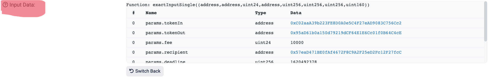

这一讲，我们以未决交易（Pending Transaction）为例，介绍如何解码交易详情。

## **未决交易**

未决交易是用户发出但没被矿工打包上链的交易，在 mempool（交易内存池）中出现。

下面是一个转账 `ERC20` 代币的未决交易，你可以在<u>etherscan</u>上查看交易详情：


红框中是这个交易的 `input data`，看似杂乱无章的十六进制数据，实际上编码了这笔交易的内容：包括调用的函数，以及输入的参数。我们在 etherscan 点击 **Decode Input Data** 按钮，就可以解码这段数据：



解码之后，我们可以看到这笔交易调用的函数以及输入的参数。

## **Interface 类**

`ethers.js` 提供了 `Interface` 类方便解码交易数据。声明 `Interface` 类型和声明 `abi` 的方法差不多，例如：

```javascript
const iface = ethers.Interface([
    "function balanceOf(address) public view returns(uint)",
    "function transfer(address, uint) public returns (bool)",
    "function approve(address, uint256) public returns (bool)"
]);
```

## **解码交易数据**

下面我们写一个解码未决交易数据的脚本。

1. 创建 `provider` 和 `wallet`，监听交易时候推荐用 `wss` 连接而不是 `http`。

```javascript
// 准备 alchemy API 可以参考https://github.com/AmazingAng/WTF-Solidity/blob/main/Topics/Tools/TOOL04_Alchemy/readme.md 
const ALCHEMY_MAINNET_WSSURL = 'wss://eth-mainnet.g.alchemy.com/v2/...';
const provider = new ethers.WebSocketProvider(ALCHEMY_MAINNET_WSSURL);
let network = provider.getNetwork()
network.then(res => console.log(`[${(new Date).toLocaleTimeString()}] 连接到 chain ID ${res.chainId}`));
```

2. 创建 `Interface` 对象，用于解码交易详情。

```javascript
const iface = new ethers.Interface([
"function transfer(address, uint) public returns (bool)",
])
```

3. 获取函数选择器。

```javascript
const selector = iface.getFunction("transfer").selector
console.log(`函数选择器是${selector}`)
```

4. 监听 `pending` 的 `ERC20` 转账交易，获取交易详情并解码：

```javascript
// 处理bigInt
function handleBigInt(key, value) {
    if (typeof value === "bigint") {
        return value.toString() + "n"; // or simply return value.toString();
    }
return value;
}

provider.on('pending', async (txHash) => {
if (txHash) {
    const tx = await provider.getTransaction(txHash)
    j++
    if (tx !== null && tx.data.indexOf(selector) !== -1) {
        console.log(`[${(new Date).toLocaleTimeString()}]监听到第${j + 1}个pending交易:${txHash}`)
        console.log(`打印解码交易详情:${JSON.stringify(iface.parseTransaction(tx), handleBigInt, 2)}`)
        console.log(`转账目标地址:${iface.parseTransaction(tx).args[0]}`)
        console.log(`转账金额:${ethers.formatEther(iface.parseTransaction(tx).args[1])}`)
        provider.removeListener('pending', this)
    }
}})
```

console

```javascript
函数选择器是0xa9059cbb
[15:19:10]连接到chain-id:11155111
[15:19:16]监听到第39个pending交易:0x660386c335ba092f98432f4ae608f1765ac553b4c1cbb6a2dc6c8b8218ef95ae
打印解码交易详情:{
  "fragment": {
    "type": "function",
    "inputs": [
      {
        "name": "",
        "type": "address",
        "baseType": "address",
        "indexed": null,
        "components": null,
        "arrayLength": null,
        "arrayChildren": null
      },
      {
        "name": "",
        "type": "uint256",
        "baseType": "uint256",
        "indexed": null,
        "components": null,
        "arrayLength": null,
        "arrayChildren": null
      }
    ],
    "name": "transfer",
    "constant": false,
    "outputs": [
      {
        "name": "",
        "type": "bool",
        "baseType": "bool",
        "indexed": null,
        "components": null,
        "arrayLength": null,
        "arrayChildren": null
      }
    ],
    "stateMutability": "nonpayable",
    "payable": false,
    "gas": null
  },
  "name": "transfer",
  "args": [
    "0x4dc1a725CCD14F9B97c308910964eefc1895E943",
    "170000000000000000n"
  ],
  "signature": "transfer(address,uint256)",
  "selector": "0xa9059cbb",
  "value": "0n"
}
转账目标地址:0x4dc1a725CCD14F9B97c308910964eefc1895E943
转账金额:0.17
```

1. 交易参数解码：


## **总结**

这一讲，我们介绍了 `ethers.js` 的 `Interface` 类，并利用它解码了 `mempool` 中的 `transfer` 交易。
