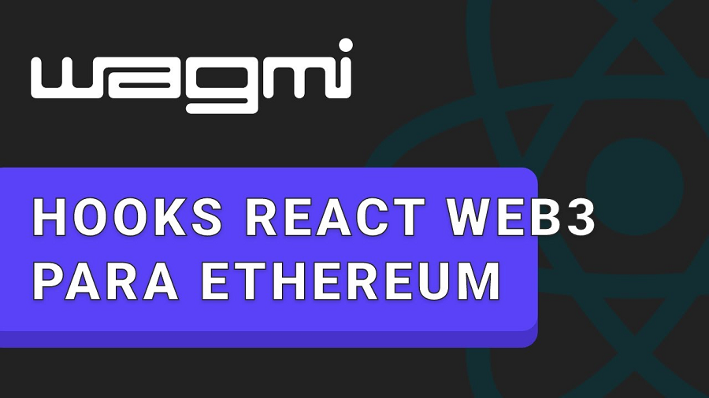

Wagmi 是专为以太坊量身定制的 React Hook 集合。 本教程对 Wagmi 从核心概念到实际应用进行了详细的探索，为希望将以太坊与 React 应用程序集成的开发人员提供了全面的指南。



以太坊区块链生态系统一直在快速发展，开发人员可用的工具和库也随之变得更加复杂。 Wagmi 是彻底改变开发过程的工具之一，它是专为以太坊量身定制的 React Hook 集合。 本文对 Wagmi 从核心概念到实际应用进行了详细的探索，为希望将以太坊与 React 应用程序集成的开发人员提供了全面的指南。

## **1、Wagmi 概述**

Wagmi 是 We are gonna make it 的缩写，代表“我们将成功”，包含一组旨在与以太坊配合使用的 React Hooks 和实用程序。

Wagmi 的目的是简化了 React 开发人员与以太坊区块链和智能合约的交互。其主要特征包括：

- 简单高效：Wagmi 提供易于使用的 API，使区块链交互变得更容易。
- 可组合性：利用 React Hooks，Wagmi 可以简单地组合复杂的功能。
- 可定制性：为开发人员提供根据其特定需求定制解决方案的灵活性。

## **2、连接到 Polygon 网络**

要使用 wagmi 和 Alchemy 提供程序连接到 Polygon 网络，你需要使用正确的网络设置和 Alchemy RPC URL 配置 wagmi。 wagmi 是一组适用于以太坊的 React Hooks，它简化了连接到以太坊区块链（包括 Polygon 等网络）的过程。

### **2.1 安装 wagmi 和依赖项**

如果你尚未安装 wagmi 及其对等依赖项（以太坊），可以使用 npm 或 YARN ：

```bash
npm install wagmi ethers
//或
yarn add wagmi ethers
```

### **2.2 使用 Alchemy 的 Polygon RPC 配置 Wagmi**

在你的 React 应用程序中，需要使用 Polygon 网络的 Alchemy RPC URL 设置 wagmi 提供程序。 你将使用 wagmi 的 configureChains 函数来配置 Polygon 链和 Alchemy 提供程序。

首先，从 wagmi 和 ethers 导入必要的函数和常量：

```javascript
import { configureChains, createClient, defaultChains, Chain } from 'wagmi'
import { publicProvider } from 'wagmi/providers/public'
import { AlchemyProvider } from '@ethersproject/providers'
```

接下来，使用 Alchemy 配置 Polygon 链：

```javascript
const alchemyId = 'your-alchemy-app-id' // Replace with your Alchemy App ID
```

```javascript
const polygonChain: Chain = {
  id: 137, // Chain ID for Polygon Mainnet
  name: 'Polygon',
  network: 'polygon',
  nativeCurrency: {
    decimals: 18,
    name: 'Polygon',
    symbol: 'MATIC',
  },
  rpcUrls: {
    default: `https://polygon-mainnet.g.alchemy.com/v2/${alchemyId}`,
  },
  blockExplorers: {
    default: { name: 'PolygonScan', url: 'https://polygonscan.com/' },
  },
  testnet: false,
};

const { chains, provider } = configureChains(
  [polygonChain],
  [
    new AlchemyProvider(137, alchemyId), // Polygon Mainnet
    publicProvider()
  ]
);
```

### **2.3 创建一个 Wagmi 客户端**

配置链和提供者后，你需要创建一个 wagmi 客户端：

```javascript
const client = createClient({
  autoConnect: true,
  provider,
  webSocketProvider: () => new ethers.providers.WebSocketProvider(`wss://polygon-mainnet.g.alchemy.com/v2/${alchemyId}`)
});
```

### **2.4 使用 Wagmi 的 Provider 包装应用程序**

最后，使用 wagmi 的 Provider 包装你的应用程序组件：

```javascript
import { Provider } from 'wagmi'

function App() {
  return (
    <Provider client={client}>
      {/* rest of your app */}
    </App>
  )
}
```

### **2.5 在组件中使用 Wagmi Hooks**

现在，你可以在组件中使用 wagmi hooks 通过 Alchemy 与 Polygon 网络进行交互。

注意：

- 将“your-alchemy-app-id”替换为你的实际 Alchemy 应用程序 ID。
- 确保你拥有 Alchemy 提供的 Polygon 网络的正确 RPC URL。
- 所示设置适用于 Polygon 主网。 如果要连接 Mumbai 测试网，则需要相应更改链 ID 和 RPC URL。

通过执行这些步骤，你的 React 应用程序将被设置为使用 Alchemy 作为提供者连接到 Polygon 网络，并利用 wagmi 库实现以太坊相关功能。

## **3、结束语**

Wagmi 是 React 生态系统中以太坊开发的高效工具。 它专注于通过熟悉的 React Hooks API 简化区块链交互，不仅增强了开发人员体验，还为 Web 应用程序中创新的以太坊集成打开了大门。需要更多的信息请看 [wagmi](https://wagmi.sh/) 。
