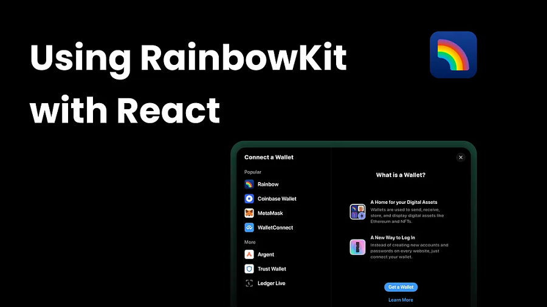
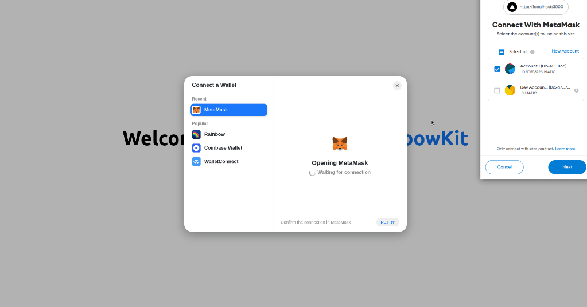
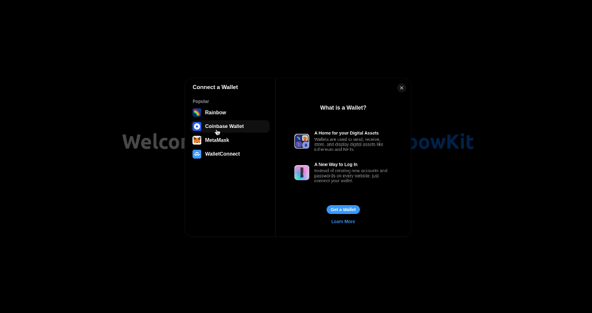
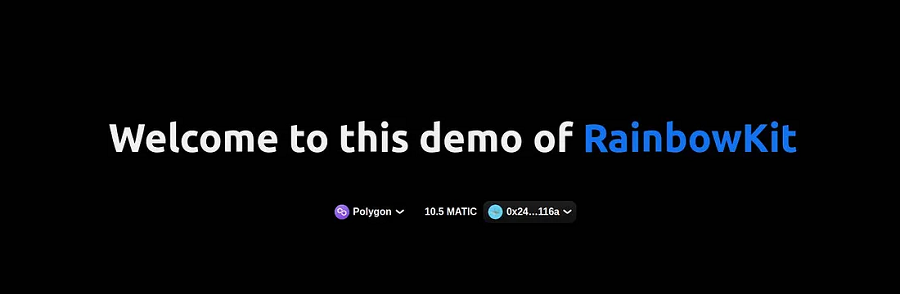
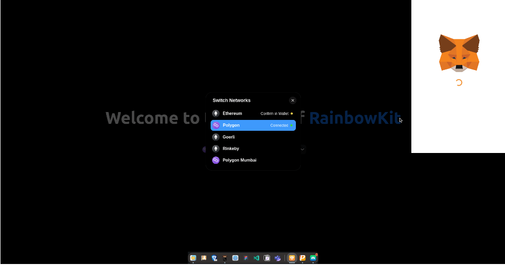
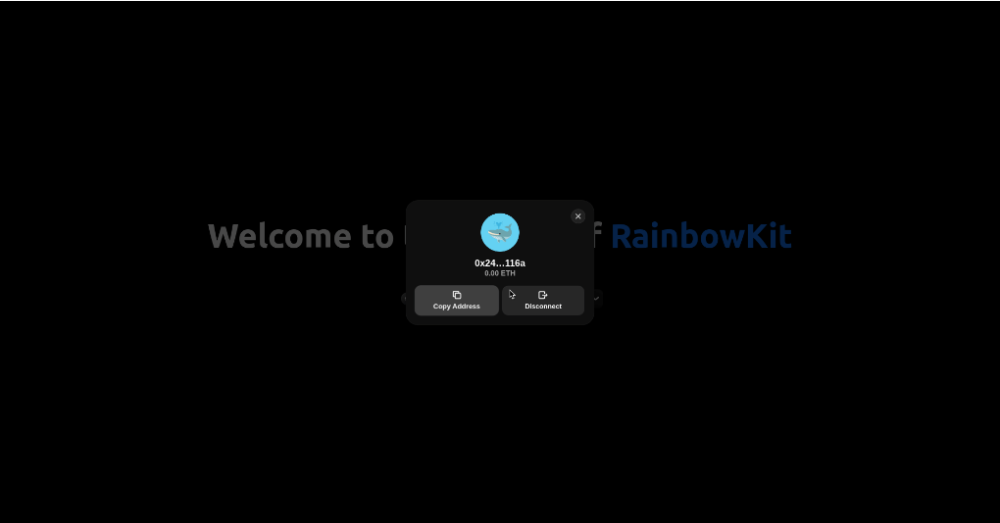
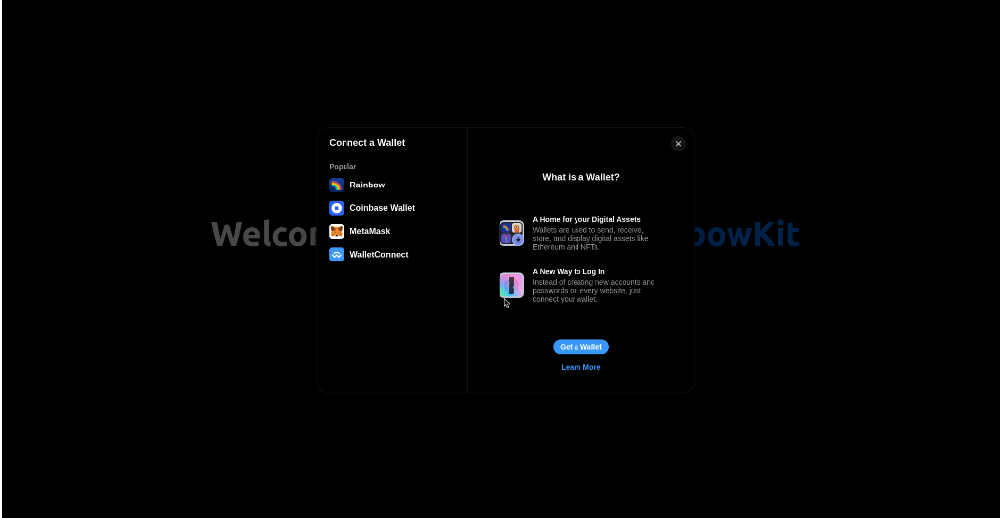

RainbowKit 是一个用几行代码构建 Connect Wallet UI 的 React 组件库。 RainbowKit 支持许多钱包，包括 Metamask、Rainbow、Coinbase Wallet、WalletConnect 等等。



Web3 中的身份验证非常简单，但支持所有钱包并制作漂亮的 UI 可能会很痛苦且耗时。 值得庆幸的是，有许多库使这变得非常容易。 今天我们将考虑将 <u>RainbowKit</u> 添加到 React 应用程序中。

## **1、什么是 RainbowKit？**

RainbowKit 是一个 React 库，它为我们提供了用几行代码构建 Connect Wallet UI 的组件。 它支持许多钱包，包括 Metamask、Rainbow、Coinbase Wallet、WalletConnect 等等。 它也是高度可定制的，并带有令人惊叹的内置主题。

RainbowKit 在底层使用了<u> Ethers.js</u> 和 <u>Wagmi</u>，这两个库都是该领域流行的库。

此外，它是由 Rainbow 钱包背后的同一团队开发的。

## **2、创建一个新的 Next 应用程序**

运行以下命令创建一个新的 **Next** 应用程序（请注意，你也可以在常规 React 应用程序上使用它）：

```
//With NPM
npx create-next-app rainbowkit-demo

//With yarn
yarn create next-app rainbowkit-demo
```

现在，进入项目目录并在您喜欢的代码编辑器中打开它。

## **3、将 RainbowKit 添加到 React 应用程序中**

运行以下命令来安装 RainbowKit 及其对等依赖项 -

```sql
# With NPM
npm install @rainbow-me/rainbowkit wagmi ethers
# With yarn
yarn add @rainbow-me/rainbowkit wagmi ethers
```

现在将以下代码添加到 pages/_app.js：

```javascript
import "../styles/globals.css";
import "@rainbow-me/rainbowkit/styles.css";
import {
  apiProvider,
  configureChains,
  getDefaultWallets,
  RainbowKitProvider,
} from "@rainbow-me/rainbowkit";
import { chain, createClient, WagmiProvider } from "wagmi";
const { chains, provider } = configureChains(
  [
    chain.mainnet,
    chain.polygon,
    chain.goerli,
    chain.rinkeby,
    chain.polygonMumbai,
  ],
  [apiProvider.fallback()]
);
const { connectors } = getDefaultWallets({
  appName: "My RainbowKit App",
  chains,
});
const wagmiClient = createClient({
  autoConnect: true,
  connectors,
  provider,
});
function MyApp({ Component, pageProps }) {
  return (
    <WagmiProvider client={wagmiClient}>
      <RainbowKitProvider chains={chains}>
        <Component {...pageProps} />
      </RainbowKitProvider>
    </WagmiProvider>
  );
}
export default MyApp;
```

首先，我们导入 RainbowKit 样式、RainbowKitPovider 和其他函数来配置我们的链，以及 WagmiProvider。

接下来，我们配置想要支持的链。 在此示例中，我添加了以太坊主网、Polygon 主网、Sepolia 和 Rinkeby（均为以太坊测试网络）以及 Polygon Mumbai 测试网。 我们使用公共后备 RPC URL 来为我们的 API 提供商提供此演示。 RainbowKit 还允许我们为 API 提供商指定我们自己的 JSON RPC URL 或 Alchemy 或 Infura URL。 可以在<u>此处</u>查看 API 提供商文档。

接下来，我们创建 wagmiClient，传入 autoConnect 并将其设置为 true。 我们的应用程序将通过这种方式自动重新连接到上次使用的连接器。

最后，我们用 WagmiProvider 和 RainbowKitProvider 包装我们的应用程序。

接下来，让我们将“连接钱包”按钮添加到我们的应用程序中。 将 pages/index.js 中的代码替换为以下内容 -

```javascript
import { ConnectButton } from "@rainbow-me/rainbowkit";
import Head from "next/head";
import styles from "../styles/Home.module.css";
export default function Home() {
  return (
    <div className={styles.container}>
      <Head>
        <title>RainbowKit Demo</title>
        <meta
          name="description"
          content="Demo app part of a tutorial on adding RainbowKit to a React application"
        />
        <link rel="icon" href="/favicon.ico" />
      </Head>
      <main className={styles.main}>
        <h1 className={styles.title} style={{ marginBottom: "4rem" }}>
          Welcome to this demo of{" "}
          <a href="https://www.rainbowkit.com/">RainbowKit</a>
        </h1>
        <ConnectButton />
      </main>
    </div>
  );
}
```

现在运行 `npm run dev` 或 `yarn dev` 并在浏览器中打开 localhost:3000，你应该看到这个 -



## **4、调成深色模式 🌑**

是时候确保我们的眼睛不再被灼伤了。

转到 pages/_app.js 并从 RainbowKit 导入 midnightTheme 函数。 （或者，你也可以导入 darkTheme 函数，这是午夜的调光版本）

```javascript
import {
  apiProvider,
  configureChains,
  getDefaultWallets,
  midnightTheme,
  RainbowKitProvider,
} from "@rainbow-me/rainbowkit";
```

我们还必须将主题传递给 RainbowKit Provider -

```
<RainbowKitProvider chains={chains} theme={midnightTheme()}>
```

RainbowKit 支持更高级的主题，你可以在<u>此处</u>查看 RainbowKit 主题文档以获取更多信息。

另外，将这一小段代码添加到 styles/globals.css 中，以使我们的应用程序也成为深色模式 -

```css
body {
  background-color: #010101;
  color: #f0f0f0;
}
```

现在我们的应用程序应该如下所示 -



## **5、RainbowKit 之旅**

使用钱包进行身份验证后，我们的连接按钮将自动更改为网络切换器，它还会向我们显示我们的余额和钱包地址 -



切换网络就像单击网络切换器然后选择我们要切换到的网络一样简单 -



点击你的钱包地址，我们会看到一个模式，可以选择复制我们的地址或断开钱包 -



## **6、酷炫模式 😎**

让我们的应用程序变得更酷一点:) 只需将 CoolMode 属性添加到 RainbowKitProvider -

```
<RainbowKitProvider chains={chains} theme={midnightTheme()} coolMode>
```

现在，如果我们单击连接模式中的任何选项，将得到一些令人惊叹的五彩纸屑 🎊



## **7、结束语**

本教程是 RainbowKit 功能的基本演示，但它还可以做更多事情，例如显示最近的交易。 需要更多功能可以在 [RainbowKit 文档](https://www.rainbowkit.com/?ref=defiplot.com) 查询。
